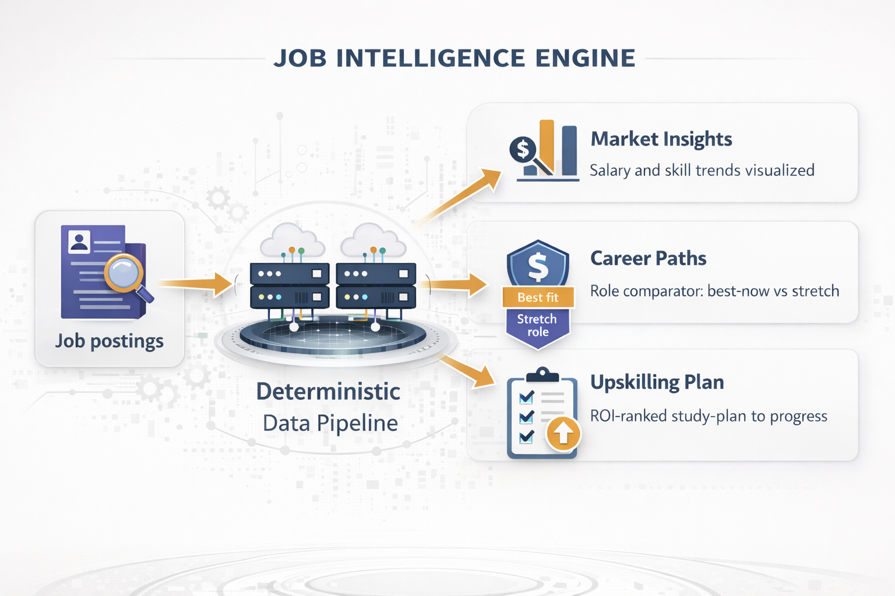
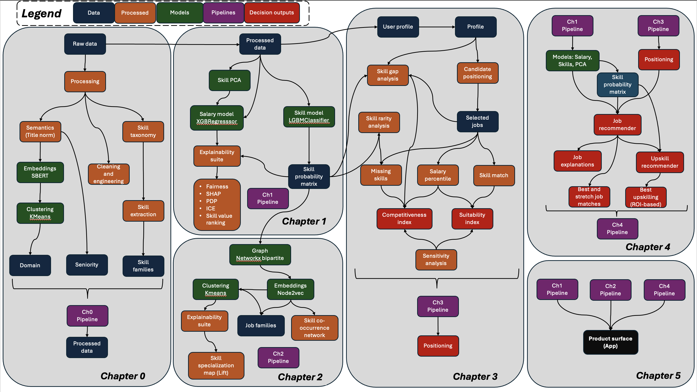
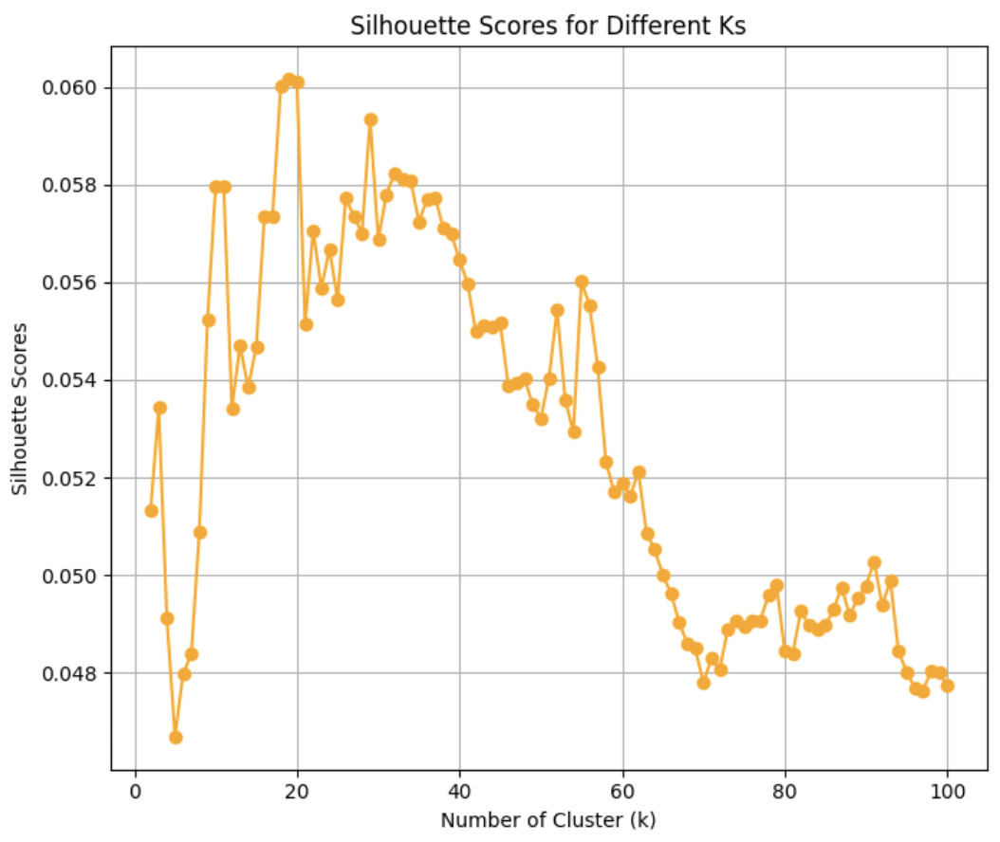

# Job Intelligence Engine — Technical Report
Version: 2026-01-02  
Repo: <https://github.com/AlejandroFuentePinero/job-intelligence-engine>  
Live App: <link>  
Author: Alejandro de la Fuente
Data access:
    - [Data Scientist Jobs](https://www.kaggle.com/datasets/andrewmvd/data-scientist-jobs?select=DataScientist.csv)
    - [Data Analyst Jobs](https://www.kaggle.com/datasets/andrewmvd/data-analyst-jobs)
    or `data/raw/`
---

## Important notes

### How to read this (routing)

- **Fast overview:** start with the **README** for the project narrative, scope, and how to run.
- **Evidence + plots (recommended):** open the **Streamlit app**, which contains the primary result figures and interpretation panels (salary model, residual slices, SHAP, calibration, clustering diagnostics, recommender behaviour checks).
- **Deep technical detail (this document):** use this report for methods, artefact contracts, determinism/testing guarantees, and interpretation boundaries.

### Evidence and traceability (where plots and evaluations live)

This technical report is intentionally **plot-light**. The project includes many supporting figures and evaluation outputs that are **already generated and stored in the repo**; duplicating them here would add noise and inflate the document without improving auditability.

- **Figures supporting results and conclusions:** `docs/narrative/figures/`  
  The most decision-relevant figures are also surfaced directly in the app (especially the **Landscape** page), alongside short interpretation notes.

- **Evaluation + guardrails (runnable):** `src/job_intel/evaluation/`  
  In addition to per-script checks inside the pipelines, the project includes an evaluation layer that runs in parallel to enforce schema integrity, index alignment, determinism, and behavioural invariants. These evaluators are designed to be executed alongside the pipelines and interpreted in-context, so full evaluation logs are omitted here.

To avoid unnecessary duplication and clutter, interpretation is kept high-level in Sections **13–14**, and only essential metrics are repeated throughout the report. For primary evidence, use the **app** and the **figure directory** above.

---

## Table of Contents

- [0. Abstract](#0-abstract)
- [1. Executive Summary](#1-executive-summary)
  - [What it delivers (high-level outcomes, surfaced as products)](#what-it-delivers-high-level-outcomes-surfaced-as-products)
  - [Why it’s credible](#why-its-credible)
  - [Key results snapshot](#key-results-snapshot)
  - [Where to see it (app + demo scenario)](#where-to-see-it-app--demo-scenario)
- [2. Introduction](#2-introduction)
- [3. System Overview and Contributions](#3-system-overview-and-contributions)
  - [Design principles](#design-principles)
  - [High-level artefact map (what is saved and reused)](#high-level-artefact-map-what-is-saved-and-reused)
- [Artefact Index (Core Outputs Referenced in This Report)](#artefact-index-core-outputs-referenced-in-this-report)
- [4. Data and Provenance](#4-data-and-provenance)
  - [4.1 Sources and coverage](#41-sources-and-coverage)
  - [4.2 Inclusion / exclusion rules](#42-inclusion--exclusion-rules)
  - [4.3 Salary parsing and normalisation](#43-salary-parsing-and-normalisation)
  - [4.4 Missingness policy and key-field robustness](#44-missingness-policy-and-key-field-robustness)
  - [4.5 Train/test strategy and leakage controls (modelling layers)](#45-traintest-strategy-and-leakage-controls-modelling-layers)
  - [Table 1. Dataset overview (canonical processed dataset)](#table-1-dataset-overview-canonical-processed-dataset)
  - [Table 2. Missingness and key-field quality checks (raw → processed)](#table-2-missingness-and-key-field-quality-checks-raw--processed)
- [5. Unified Methods](#5-unified-methods)
  - [5.1 Title normalisation (role identity, seniority, domain)](#51-title-normalisation-role-identity-seniority-domain)
  - [5.2 Skill extraction and skill-family representation (taxonomy-driven, deterministic)](#52-skill-extraction-and-skill-family-representation-taxonomy-driven-deterministic)
  - [5.3 Salary modelling (response layer + explainability)](#53-salary-modelling-response-layer--explainability)
  - [5.4 Skill requirement modelling (probabilistic demand layer)](#54-skill-requirement-modelling-probabilistic-demand-layer)
  - [5.5 Market geometry (job–skill graph → embeddings → job families)](#55-market-geometry-jobskill-graph--embeddings--job-families)
  - [5.6 Individual positioning (suitability, competitiveness, gaps, robustness)](#56-individual-positioning-suitability-competitiveness-gaps-robustness)
  - [5.7 Recommender (best_now vs stretch + salary alignment)](#57-recommender-best_now-vs-stretch--salary-alignment)
  - [5.8 Counterfactual upskilling (ROI-ranked skill investments)](#58-counterfactual-upskilling-roi-ranked-skill-investments)
  - [5.9 Macro overlay (adjacent families + co-learning skills)](#59-macro-overlay-adjacent-families--co-learning-skills)
- [6. Representation Layer](#6-representation-layer)
  - [6.1 Job Title Normalization](#61-job-title-normalization)
  - [6.2 Skill Extraction and Skill Families](#62-skill-extraction-and-skill-families)
  - [Table 3. Skill family summary (schema-level; v1 canonical)](#table-3-skill-family-summary-schema-level-v1-canonical)
- [7. Predictive Modelling Layer](#7-predictive-modelling-layer)
  - [7.1 Salary Model](#71-salary-model)
  - [7.2 Skill Requirement Models](#72-skill-requirement-models)
  - [Table 4. Salary model performance (overall + reporting slices)](#table-4-salary-model-performance-overall--reporting-slices)
  - [Table 5. Skill requirement model performance (overall + tiers + hardest skills)](#table-5-skill-requirement-model-performance-overall--tiers--hardest-skills)
- [8. Market Structure Layer (Hidden Geometry)](#8-market-structure-layer-hidden-geometry)
  - [8.1 Job–Skill Bipartite Graph](#81-jobskill-bipartite-graph)
  - [8.2 Embeddings and Job Families](#82-embeddings-and-job-families)
  - [8.3 Skill Co-occurrence Network](#83-skill-co-occurrence-network)
  - [8.4 Skill Specialisation (Lift Analysis)](#84-skill-specialisation-lift-analysis)
- [9. Individual Positioning (User → Market)](#9-individual-positioning-user--market)
  - [9.1 User profile schema and validation](#91-user-profile-schema-and-validation)
  - [9.2 Candidate retrieval and constraint filters](#92-candidate-retrieval-and-constraint-filters)
  - [9.3 Suitability: definition and interpretability](#93-suitability-definition-and-interpretability)
  - [9.4 Competitiveness: definition and rationale](#94-competitiveness-definition-and-rationale)
  - [9.5 Skill gap analysis and severity ranking](#95-skill-gap-analysis-and-severity-ranking)
  - [Table 6. Positioning output schema (core tables)](#table-6-positioning-output-schema-core-tables)
- [10. Recommendation and Upskilling Engine](#10-recommendation-and-upskilling-engine)
  - [10.1 Recommendations (best_now vs stretch)](#101-recommendations-best_now-vs-stretch)
  - [10.2 Counterfactual Upskilling](#102-counterfactual-upskilling)
  - [Table 7. Recommendation output schema (core tables)](#table-7-recommendation-output-schema-core-tables)
- [11. Macro Lens Overlay (Context, Not Re-ranking)](#11-macro-lens-overlay-context-not-re-ranking)
  - [11.1 Co-learning Neighbours](#111-co-learning-neighbours)
- [12. Evaluation, Determinism, and Reliability Contracts](#12-evaluation-determinism-and-reliability-contracts)
  - [12.1 Canonical dataset reproducibility (Chapter 0 benchmark)](#121-canonical-dataset-reproducibility-chapter-0-benchmark)
  - [12.2 Predictive model evaluation (Chapter 1)](#122-predictive-model-evaluation-chapter-1)
  - [12.3 Latent artefact integrity (Chapter 2 contracts)](#123-latent-artefact-integrity-chapter-2-contracts)
  - [12.4 Positioning and recommender correctness (Chapters 3–4)](#124-positioning-and-recommender-correctness-chapters-34)
  - [12.5 App-level smoke testing (Chapter 5)](#125-app-level-smoke-testing-chapter-5)
  - [12.6 Evaluation artefact index](#126-evaluation-artefact-index)
  - [12.7 Recommender validity checks (behavioural)](#127-recommender-validity-checks-behavioural)
- [13. Results, Discussion, and Conclusions (Unified)](#13-results-discussion-and-conclusions-unified)
  - [What worked well (evidence-backed)](#what-worked-well-evidence-backed)
  - [Where the engine is most reliable (and why)](#where-the-engine-is-most-reliable-and-why)
  - [Key trade-offs](#key-trade-offs)
  - [Known failure modes and how they present](#known-failure-modes-and-how-they-present)
  - [Implications for users (how to act responsibly)](#implications-for-users-how-to-act-responsibly)
  - [Conclusions](#conclusions)
- [14. Research-Style Summary of Findings (Market Mechanisms)](#14-research-style-summary-of-findings-market-mechanisms)
- [15. Deployment and Public App](#15-deployment-and-public-app)
  - [15.1 Platform choice and rationale (Streamlit)](#151-platform-choice-and-rationale-streamlit)
  - [15.2 UX flow (inputs → run → outputs)](#152-ux-flow-inputs--run--outputs)
  - [15.3 Runtime strategy: artefact loading, caching, and performance](#153-runtime-strategy-artefact-loading-caching-and-performance)
  - [15.4 Privacy stance (what is stored, what is not)](#154-privacy-stance-what-is-stored-what-is-not)
  - [15.5 Hosting and CI/CD (lightweight)](#155-hosting-and-cicd-lightweight)
- [16. Engineering Quality: Reproducibility, Testing, and Contracts](#16-engineering-quality-reproducibility-testing-and-contracts)
- [17. Assumptions, Limitations, and Ethical Use](#17-assumptions-limitations-and-ethical-use)
  - [17.1 Data bias and representativeness](#171-data-bias-and-representativeness)
  - [17.2 Salary measurement limits](#172-salary-measurement-limits)
  - [17.3 Skill extraction and ontology limits](#173-skill-extraction-and-ontology-limits)
  - [17.4 Interpretability boundaries: association, not causation](#174-interpretability-boundaries-association-not-causation)
  - [17.5 Competitiveness and user representation limits](#175-competitiveness-and-user-representation-limits)
  - [17.6 Appropriate use and misuse risks](#176-appropriate-use-and-misuse-risks)
- [18. Future Work (Prioritized Roadmap)](#18-future-work-prioritized-roadmap)
  - [18.1 High-ROI next steps (recommended v2 priorities)](#181-high-roi-next-steps-recommended-v2-priorities)
  - [18.2 Nice-to-have extensions (value-add once v2 foundations are stable)](#182-nice-to-have-extensions-value-add-once-v2-foundations-are-stable)
  - [18.3 Explicit dependencies (what additional data/infrastructure enables)](#183-explicit-dependencies-what-additional-data-infrastructure-enables)
- [19. Reproducibility pointers](#19-reproducibility-pointers)
- [Appendices](#appendices)
  - [Appendix A — Canonical Project Documents (Further Reading)](#appendix-a--canonical-project-documents-further-reading)
  - [Appendix B — Glossary](#appendix-b--glossary)

---

## 0. Abstract

The data job market is difficult to navigate not because information is scarce, but because it is fragmented: roles overlap while being described with inconsistent terminology, and skill requirements are expressed as long, noisy lists with substantial synonymy. As a result, “good fit” and “what to learn next” are often decided by manual scanning and generic advice rather than by evidence grounded in observed demand.

Job Intelligence Engine converts job postings into a queryable market landscape and uses it to position an individual to learn the most suitable jobs and optimal upskilling. From public job postings databases, the pipeline standardises titles, seniority, company metadata, and salary targets, and extracts a curated skill taxonomy mapped into aggregated skill families. It then learns two complementary signals: a salary response model that estimates expected pay and provides interpretable drivers via residual diagnostics and SHAP attributions, and a suite of per-skill probabilistic requirement models that estimate how likely each skill family is demanded by each job (yielding a dense job × skill probability matrix).

These market artefacts are turned into decision support by computing two orthogonal user-conditioned measures—**suitability** (fit to current skills and targets) and **competitiveness** (barriers implied by missing, probabilistic requirements)—to produce **best-now** and **stretch** recommendations with explicit gap explanations. Upskilling is framed as counterfactual analysis: the engine simulates acquiring missing skill families, recomputes positioning, and ranks skills by measurable lift in realistic targetability.

A lightweight Streamlit app packages the workflow using persisted artefacts (no retraining) and contract-style evaluations that enforce schema alignment, determinism, and fail-fast behaviour. Limitations reflect the data: postings are imperfect proxies for hiring decisions, skill signals are text-derived, and salary fields are heterogeneous; outputs are intended for decision support rather than causal claims.

---

## 1. Executive Summary

**Job Intelligence Engine** is a deterministic, end-to-end job-market intelligence system that converts job postings into interpretable market signals and a constraint-aware recommender. It addresses a practical job-search failure mode: roles and skills overlap heavily in meaning while being described with inconsistent terminology, so “fit”, “stretch”, and “what to learn next” often devolve into manual scanning and generic advice. This project learns a structured market landscape from real postings (salary structure + probabilistic skill demand), then positions an individual within that landscape under explicit constraints to produce **best-now** roles, **stretch** roles, and an **ROI-ranked upskilling plan** grounded in observed demand rather than guesswork.

<figure>
  
  <figcaption style="text-align:center; font-size:0.9em; color:#666;">
    Figure 1. Summarised project pipeline.
  </figcaption>
</figure>

---

### What it delivers (high-level outcomes, surfaced as products)

- **Queryable market landscape:** a canonical processed dataset with normalised titles/seniority, harmonised salary targets, and a curated skill taxonomy mapped into aggregated skill families—enabling analysis without brittle keyword matching.
- **Salary structure + “why” explanations:** a tuned salary response model that estimates expected pay and supports both **residual-based diagnostics** (where pay deviates after controlling for job mix) and **SHAP explainability** (which factors the model values and how).
- **Probabilistic skill demand layer:** per-skill requirement models that convert sparse skill mentions into calibrated probabilities, producing a dense job × skill demand surface suitable for ranking, weighting, clustering, and gap analysis.
- **Hidden market organisation:** graph/embedding-based structure that reveals job families and skill ecosystems (co-occurrence/similarity), used for macro context and “co-learning neighbour” signals.
- **Individual positioning + recommendations:** a constraint-aware recommender that generates **best_now** vs **stretch** job shortlists, explicit skill-gap explanations, and an **ROI-ranked upskilling plan** via counterfactual skill additions.
- **App surface:** a Streamlit UI that loads artefacts and runs the recommender deterministically for a demo persona or custom inputs, producing exportable tables/figures for inspection.

---

### Why it’s credible

The project enforces **cross-component contracts** and **reproducibility across multiple scopes** (single modules or the full system) through dedicated evaluation pipelines.

- **Contract-first evaluations across artefacts:** integrity checks enforce consistent `job_id` universes and ordering across jobs tables, skill-probability matrices, embeddings, and cluster assignments; probabilities are bounded and finite; schemas and required columns must exist.
- **Regression benchmark for the base dataset:** a rebuild-vs-benchmark comparison detects silent changes in the processed dataset after refactors (schema drift, parsing changes, value-level mismatches).
- **Fail-fast input validation:** empty candidate universes, missing required probability columns, misaligned IDs, or malformed profile inputs raise explicit errors early (preventing “quietly wrong” outputs).
- **Module-level + integration-level evaluation:** positioning, recommender, and app-entry pipelines are tested for expected output schemas, non-overlap constraints (best_now vs stretch), sorted rankings, type correctness, and scenario-table integrity.
- **Determinism checks where it matters:** repeated runs under fixed inputs must reproduce the same rankings and key tables; sensitivity outputs are bounded and normalised.
- **Reproducible at multiple levels:** you can rebuild a single layer (e.g., salary explainability assets, job-family clustering, recommender outputs) or run the full orchestration end-to-end—pipelines are stackable and selectively callable.

---

### Key results snapshot

**Market mechanisms: salary**
- The salary model learns that **market structure dominates** pay: enriched role identity, location, sector, and company size explain most systematic variation, with skill composition shaping outcomes *within* those structures rather than replacing them.
- Residual diagnostics show coherent, model-adjusted gradients: high-demand states trend above expectation; innovation- and tech-intensive sectors pay premiums; large/public organisations tend to overpay relative to mix; analyst-oriented role families systematically underpay relative to modelling/ML-heavy roles.
- SHAP analysis supports this mechanism-level interpretation: role/market context drives the largest contributions; some skill components act as **gatekeepers** (penalise low baseline competence), while ML-intensity components produce **threshold-like premiums** rather than smooth linear effects.

**Market mechanisms: skill demand**
- The probabilistic requirement layer is strong and well-calibrated for most skills, producing realistic probability gradients rather than binary jumps.
- Skill demand is driven primarily by **role identity + market context** (title/domain, sector, location), with co-occurring skills providing structured conditional signals (e.g., analytics ↔ ML ↔ programming; cloud ↔ data engineering).

**Hidden structure**
- Weighted job–skill graphs and embeddings expose stable job families and skill ecosystems that align with interpretable functional groupings, enabling macro context (adjacent families) and “co-learning neighbour” suggestions without re-ranking the core recommendations.
 
**Decision support quality**
    - **Two ranked job shortlists:** a **best_now** list of roles the user can credibly target under their constraints with high current-fit, and a **stretch** list of higher-upside roles that remain plausible but require material upskilling.
    - **Job-specific explanations:** for each recommended role, the engine returns a concise “why” summary plus a structured breakdown of the dominant drivers (fit factors and the main barriers).
    - **Skill-gap map tied to targets:** an aggregated view of which **skill families** are most consistently missing across the user’s top stretch targets, and which requirements are most probable in those jobs.
    - **ROI-ranked upskilling plan:** a ranked set of skill families where acquiring each one is estimated to produce the largest positioning lift, computed via counterfactual simulation (temporarily adding the skill family and recomputing suitability/competitiveness and bucket movement).
    - **Stability + validity guarantees:** recommendation outputs are deterministic for fixed inputs, buckets are non-overlapping by construction, and all tables satisfy strict schema and alignment contracts validated by evaluation pipelines.

**Minimal metric snapshot**
- Salary response model: test performance in the expected range for noisy posting salaries (R² ≈ 0.30; MAE ≈ 25k).
- Skill requirement models: strong discrimination for most skills (typical ROC AUC ≈ 0.88–0.95; PR AUC highest for common skills and lower for rare “advanced” skills as expected).

---

### Where to see it (app + demo scenario)

- [**Repository**](https://github.com/AlejandroFuentePinero/job-intelligence-engine)
- **Live app:** [PLACEHOLDER: Live App URL]

---

## 2. Introduction

Job search in data science is hard because the option space is dense and high-dimensional. Many roles are near-neighbours in purpose yet differ in subtle, consequential ways: expected scope, seniority, domain context, tooling, and modelling depth. At the same time, job ads describe these differences using inconsistent language. Titles overlap while signalling different responsibilities, skill requirements are long lists with substantial synonymy and variable specificity, and salary ranges reflect strong structural gradients across geography, sector, and firm type. From a candidate’s perspective, this creates uncertainty at exactly the decision points that matter: which roles to prioritise, what “fit” means beyond keywords, and which skill investments are most likely to improve access to better opportunities.

A practical response is to build a system that learns the market’s structure directly from postings and turns it into decision support. Job Intelligence Engine does this by transforming job ads into structured job attributes and a curated skill taxonomy, then learning two complementary market layers: a salary response layer that captures how compensation relates to role context and skill composition, and a probabilistic skill-demand layer that estimates how strongly different skill families are associated with each job. Together these layers provide a market representation that supports comparison across roles even when terminology differs, and enables users to reason about trade-offs between salary potential, fit, and skill barriers without manually reading hundreds of postings.

The project is built around concrete engineering goals aligned to those user decisions. The system positions an individual profile under hard constraints defined by the user, separates **suitability** from **competitiveness**, and produces two ranked shortlists—**best_now** and **stretch**—with explicit explanations of the main drivers and missing requirements. It then generates an ROI-ranked upskilling plan by simulating the acquisition of missing skill families and measuring the resulting lift in positioning and shortlist movement. The intent is to reduce time spent on low-signal scanning and improve the quality of targeting and learning decisions by grounding them in measured demand structure; these benefits extend naturally to employers through clearer candidate–role matching, without relying on strong claims about hiring outcomes.

---

## 3. System Overview and Contributions

Figure 2 summarises the full Job Intelligence Engine as a set of **stackable pipelines** that transform raw job ads into persisted market artefacts, then reuse those artefacts to produce user-conditioned decision outputs. The left side (data → processing) establishes a canonical representation of postings: titles are normalised semantically, descriptions are cleaned, seniority and domain are inferred, and a curated skill taxonomy is extracted into a consistent skill-family space. The middle layers learn market mechanisms from those standardised features: a salary response model captures how compensation varies with role context and skill structure, and a probabilistic skill-demand layer estimates \(P(\text{skill}\mid\text{job})\) to replace brittle keyword matches with smooth demand signals. The right side operationalises those learned structures for a user: a validated profile is mapped into the same skill space, filtered into a feasible candidate universe under constraints, and positioned using two orthogonal indices—**suitability** and **competitiveness**—which are then composed into **best_now** vs **stretch** recommendations, explanations, and ROI-ranked upskilling suggestions.

The core contribution is an **end-to-end system design** that makes these components usable and reliable as a product. First, the project builds a market “landscape” that can be queried at multiple resolutions: (i) a tabular layer for salary structure and subgroup-adjusted deviations, (ii) a probabilistic demand layer for skill requirements, and (iii) a hidden-structure layer (graphs, embeddings, clustering) that exposes stable job families and skill ecosystems. Second, it introduces an explicit positioning interface that separates “fit” from “barrier”, allowing recommendations to remain interpretable under constraints (e.g., location, seniority, domain preferences, salary bounds) and making gaps legible as *probabilistic requirements* rather than binary missing keywords. Third, it implements upskilling as counterfactual inference over the market artefacts: missing skill families are temporarily added to the user profile, positioning is recomputed, and skills are ranked by measurable lift, including movement between stretch and best_now buckets. Finally, the Chapter 5 app packages these layers into a lightweight, runnable surface that loads persisted artefacts and produces reproducible outputs without retraining.

A core design principle is explicit **chapter-to-chapter contracts**. Each chapter exports a small set of persisted artefacts with fixed schemas and stable indices (notably `job_id`), and downstream chapters are written to consume only these artefacts—not intermediate notebook objects. Evaluation modules enforce these contracts (schema, dtype, index alignment, dimension invariants) so that refactors cannot silently change the meaning of downstream computations. This contract-oriented architecture is what allows the system to be reproducible at multiple granularities (single chapter rebuilds or full end-to-end rebuilds) without drift.

### Design principles

The system is engineered around three principles that are visible in both the architecture and the evaluation suite:

1. **Reproducibility as a build contract.** Every chapter can be executed independently to reproduce its outputs, and the full pipeline can be executed end-to-end to regenerate all artefacts.

2. **Explicit contracts between layers.** Downstream modules consume previous pipelines' artefacts with strict schema and alignment assumptions. These assumptions are enforced by integrity checks to prevent “quietly wrong” runs when artefacts drift.

3. **Deterministic artefacts and stable orchestration.** Randomness is controlled at build time so that embeddings, clustering, and recommendation outputs are stable under fixed inputs. Where determinism matters for decision outputs (rankings, bucket membership, explanations), it is validated by repeat-run checks.

### High-level artefact map (what is saved and reused)

The engine follows a deliberate separation between **persisted market artefacts** (built once, reused many times) and **runtime decision outputs** (computed per user run):

- **Persisted market artefacts (reused across runs):**
  - Canonical processed jobs table (cleaned job attributes + extracted skill-family indicators).
  - Salary-model artefacts (trained model + explainability/fairness assets, including SHAP bundles used by the app).
  - Skill-demand artefacts (per-skill models and the job × skill probability matrix).
  - Hidden-structure artefacts (job–skill graph; job/skill embeddings; job-family clustering; skill co-occurrence/similarity structures; skill specialisation/lift tables).
  - Demo persona and evaluation configs used consistently by app and smoke tests.

- **Runtime decision outputs (computed per user run):**
  - Candidate universe under constraints and the positioning tables (suitability, competitiveness, gaps, sensitivity).
  - Recommendation tables (best_now, stretch, job explanations).
  - Counterfactual upskilling tables (ranked skill families + affected target sets).
  - Optional macro context tables (adjacent job families, co-learning neighbour skills for the top upskilling items).

This architecture makes the system “product-like”: heavy computation is performed in build steps and saved as deterministic artefacts, while interactive usage is reduced to loading those artefacts and running lightweight scoring/positioning logic. The result is an end-to-end engine whose outputs are both inspectable (tables + explanations) and robust to refactors through contract-style evaluations.

## Artefact Index (Core Outputs Referenced in This Report)

This table lists the key persisted artefacts referenced throughout the report. The full runtime inventory is maintained in `docs/engineering/artefact_manifest_ch5_app.md`.

| Artefact | Purpose | Path | Produced by | Consumed by |
|---|---|---|---|---|
| Canonical processed dataset | Clean, unified modelling base | `data/processed/chapter0_processed_jobs.csv` | Chapter 0 pipeline | Chapters 1–4 |
| Skill dictionary / ontology | Token→family mapping contract | `docs/engineering/data_dictionary.md` | Authored + maintained | Chapter 0 extraction; reporting |
| Salary model | Salary prediction for alignment + residuals | `models/salary_model_v4.pkl` | Chapter 1 pipeline | Chapter 5 views; Chapter 4 alignment |
| Skill requirement models (27) | Per-skill demand probabilities | `models/{skill}_model.pkl` | Chapter 1 pipeline | Probability matrix; gaps/competitiveness |
| Job×skill probability matrix | Smooth demand surface | `data/processed/skill_prob_matrix.csv` | Chapter 1 pipeline | Chapter 2 graph; Chapter 3/4 logic |
| Fairness group summary | Residual slices by group | `data/processed/ch5_assets/fairness_group_summary_long.csv` | `ch5_build_fairness_assets.py` | App: Landscape |
| Residual box stats | Residual distribution summary | `data/processed/ch5_assets/fairness_residual_box_stats.json` | `ch5_build_fairness_assets.py` | App: Landscape |
| SHAP bundle | Salary explainability asset | `data/processed/ch5_assets/shap_salary_explanation.npz` | Chapter 1/5 build | App: Landscape |
| Skill value index (GSVI) | Skill-level interpretability ranking | `data/processed/ch5_assets/skill_value_index.csv` | Chapter 1/5 build | App: Landscape |
| Co-learning neighbours | Skill co-occurrence guidance | `data/processed/skill_similarity_matrix/skill_similarity_edges_k5_embeddings.csv` | Chapter 2 pipeline | App: Upskilling/Macro |
| Demo persona config | Reproducible walkthrough inputs | `src/job_intel/evaluation/recommender_demo.json` | Authored config | App + smoke test |

**Figure 2:** Artefact flow / dependency graph (chapters as modules, not silos).
<figure>
  
  <figcaption style="text-align:center; font-size:0.9em; color:#666;">
    Figure 2. System structure overview.
  </figcaption>
</figure>

---

## 4. Data and Provenance

### 4.1 Sources and coverage

The project uses two public Kaggle datasets derived from Glassdoor job postings:
- **Data Scientist jobs** (`DataScientist.csv`)
- **Data Analyst jobs** (`DataAnalyst.csv`)

These datasets are merged into a single canonical table with **one row per job ad**. The canonical output of Chapter 0 is the modelling and analysis backbone for all downstream chapters.

**Primary join key:** `job_id` (stable identifier carried across chapters and artefacts).

---

### 4.2 Inclusion / exclusion rules

The Chapter 0 pipeline applies deterministic cleaning and schema harmonisation before the dataset is admitted into modelling:

- **Schema alignment + merge:** raw columns are standardised across sources and combined into a single table.
- **Missingness normalisation:** placeholder values are converted into consistent missing-value representations.
- **Row-level exclusion:** rows missing **both** salary information **and** job description are dropped (insufficient signal for modelling or skill extraction).
- **Field-level exclusion:** sparse or unreliable raw fields are removed where they do not support stable downstream modelling.

---

### 4.3 Salary parsing and normalisation

Salary strings in the raw data appear as ranges and/or hourly rates. A custom parser converts salary text into comparable annualised numeric targets:
- `sal_min`, `sal_max`: annualised bounds (nullable)
- `sal_mean`: midpoint target used by the salary model (nullable)
- `sal_is_hourly`: indicator for hourly-to-annual conversion

Salary absence is preserved as a valid signal (i.e., salary fields may remain null).

---

### 4.4 Missingness policy and key-field robustness

The canonical dataset distinguishes between “unknown but categorical” fields (filled) and “genuinely missing numeric” fields (kept null):

- Filled with `"Unknown"` for categorical robustness: `Size`, `Industry`, `Sector`
- Kept as NA where missingness is meaningful: `Rating`, `Founded`
- Skill flags are always 0/1 (never NA)
- Salary fields may be NA if the posting does not report salary (0.02% of the salary feature)

`Rating` and `Founded` are retained in the canonical dataset for completeness/auditing, but excluded from v1 modelling feature sets due to coverage/utility constraints.

Downstream pipelines rely on explicit schema contracts (e.g., skill flags must be present and binary; `job_id` uniqueness; salary fields numeric where present).

---

### 4.5 Train/test strategy and leakage controls (modelling layers)

All model training uses a fixed, reproducible **80/20 train/test split** with **random_state = 101**.

- **Salary response model:** trained to predict `sal_mean` from job/company features and PCA skill components.
- **Skill requirement models (27×):** each binary classifier predicts a single skill-family indicator using job/company features plus the **other** skill indicators.

**Leakage controls**
- Hyperparameter search / model selection is performed on the training partition; the test split is reserved for final evaluation only.
- For the salary response model, target-derived salary text/fields are excluded from predictors; the model predicts `sal_mean` from job/company features and skill structure.
- For skill requirement models, the target skill column is excluded from the predictor set (features are “all skills except the target”), preventing direct label leakage.
- PCA is fit on the training partition and the transform is persisted and reused at inference (consistent feature space; reduced multicollinearity).

---

### Table 1. Dataset overview (canonical processed dataset)

| Item | Value |
|---|---|
| Sources | Kaggle (Glassdoor job postings): Data Scientist + Data Analyst datasets |
| Unit of analysis | One row per job ad |
| Canonical dataset size | **6,162** job ads |
| Primary key | `job_id` |
| Geography | US postings by `state` with `"international"` fallback for non-US |
| Text fields | `Job Title`, `Job Description` (cleaned for extraction) |
| Salary fields (derived) | `sal_min`, `sal_max`, `sal_mean` (annualised; nullable) + hourly indicator |
| Company metadata | e.g., `Rating`, `Founded`, `Size`, `Industry`, `Sector`, `Type of ownership`, `Revenue`, `Headquarters` |
| Skill representation | 27 binary skill-family indicators (extracted from title + description) |
| Train/test split (all models) | **80/20**, `random_state = 101` |

### Table 2. Missingness and key-field quality checks (raw → processed)

**Raw-data missingness (relevant fields only; pre-processing):**

| Field | Missing (%) | Used in modelling? | Handling / policy |
|---|---:|---:|---|
| Industry | 14.59 | ✓ | filled to `"Unknown"` (categorical robustness) |
| Sector | 14.59 | ✓ | filled to `"Unknown"` (categorical robustness) |
| Size | 6.36 | ✓ | filled to `"Unknown"` where missing |
| Type of ownership | 6.36 | ✓ | filled to `"Unknown"` where missing |
| Salary Estimate | 0.02 | ✓ | parsed into `sal_min`, `sal_max`, `sal_mean` (+ hourly annualisation flag) |
| Company Name | 0.02 | ✓ | cleaned/normalised; used for metadata only (not as a predictive identity key) |
| Job Title | 0.00 | ✓ | normalised title + seniority extraction |
| Job Description | 0.00 | ✓ | cleaned for skill extraction |
| Location | 0.00 | ✓ | parsed to `state` (US) + `"international"` fallback |

**High-missingness raw fields excluded from modelling (for clarity):**  
`Easy Apply` (96.04%), `Competitors` (72.90%), `Founded` (26.57%), `Rating` (11.05%), `Headquarters` (6.69%), and `Revenue` (6.36%) were not used downstream due to poor coverage and weak decision-support value.

These fields remain in the canonical dataset for completeness/auditing, but are not used as modelling predictors in v1.

**Key field quality contracts enforced downstream**
- `job_id` must be unique and stable across all artefacts (jobs table, skill matrices, embeddings, clustering).
- Skill-family indicators are binary (0/1) and never NA.
- Skill-probability outputs are finite and bounded in \([0, 1]\).
- Candidate universes and recommendation outputs must be non-empty under valid constraints; otherwise pipelines fail fast with explicit errors.

---

## 5. Unified Methods

This section describes the Job Intelligence Engine as a single coherent system that transforms raw job ads into (i) learned market representations and (ii) user-conditioned decision outputs. The design is modular and reproducible: each stage produces **persisted artefacts** that are reused downstream, enabling reviewers to rebuild a single layer (e.g., salary assets) or run the entire chain end-to-end. Figure 2 summarises the dependency map; the methods below follow the same left-to-right flow.

---

### 5.1 Title normalisation (role identity, seniority, domain)

Raw job titles contain high lexical variance and are not reliable identifiers of role identity. The pipeline standardises titles into a canonical representation used consistently across modelling and navigation. Titles are cleaned into a base form (`job_title_base`) and normalised for taxonomy lookup (`job_title_norm`). A curated title-family mapping assigns each posting to an interpretable `job_title_family`, and an enriched representation (`title_rich`) retains meaningful modifiers (e.g., high-level domain families) without exploding the vocabulary. Seniority cues are extracted from both title and description and combined into `seniority_combined`, reducing ambiguity where seniority is implied rather than explicitly stated.

To support segmentation beyond titles, each posting is assigned a `domain` label via a deterministic embedding-based lookup: titles are embedded with SBERT (sentence transformer) and mapped through a fixed clustering structure (KMeans) to assign stable domain labels. These role-identity fields—`job_title_family`, `title_rich`, `seniority_combined`, `domain`, and `state`—form the scaffold used by both the salary model and the skill-demand models, and they anchor user-side constraint filters.

---

### 5.2 Skill extraction and skill-family representation (taxonomy-driven, deterministic)

Skills are represented using a curated dictionary of ~1,300 skill tokens mapped into **27 aggregated skill families** (the canonical skill space used throughout the project). Skill extraction is deterministic and lightweight by design: each job’s title and cleaned description are concatenated into a unified text field and matched against multi-word phrases and unigrams using case-normalised rules. The output is a 27-dimensional multi-hot vector (0/1 family indicators) per job. This representation collapses synonym noise into stable families, supports joins across all artefacts, and provides a consistent interface for user inputs: free-text user skills are processed through the same extractor so that user and job skill vectors are directly comparable.

---

### 5.3 Salary modelling (response layer + explainability)

Salary text is parsed and normalised into annualised numeric targets (`sal_min`, `sal_max`, `sal_mean`) with an explicit hourly indicator when conversion is required. The salary response model predicts `sal_mean` from a structured feature matrix combining role identity (e.g., `title_rich`, `seniority_combined`, `domain`, `state`) and company metadata (e.g., `Size`, `Sector`, `Industry`, `ownership_clean`). Skill signals enter through a compact representation: the 27 binary skill-family indicators are projected into a low-dimensional PCA space (`skill_PC1..skill_PC10`) fit on training data and persisted for consistent reuse.

Model selection follows a reproducible split and search strategy: all modelling uses an **80/20 train/test split** (`random_state = 101`), and hyperparameter selection is performed on the training partition via scikit-learn’s `GridSearchCV` with cross-validation. The final response model (XGBoost) is persisted as a versioned artefact to support downstream pipelines and app inference without retraining. Evaluation reports standard regression metrics (R², RMSE, MAE) and is paired with interpretability outputs: residual diagnostics summarise systematic deviations by segments (model-adjusted structure), and SHAP explanations decompose predictions into additive feature contributions to support “why” narratives for both global drivers and job-level examples.

---

### 5.4 Skill requirement modelling (probabilistic demand layer)

Binary skill flags extracted from text are sparse and phrasing-dependent. To produce a smooth demand surface, the system fits **one classifier per skill family** to estimate calibrated probabilities \(P(\text{skill}_k=1 \mid \text{job})\). Each model (LightGBM) predicts a single skill-family indicator using role/company features and the remaining skill indicators as contextual predictors, with an explicit leakage control: the target skill column is excluded from the feature matrix (“all skills except the target”). Training uses the same **80/20 split** and fixed random state, and evaluation emphasises both discrimination and calibration (ROC AUC, PR AUC, Brier score; plus ROC/PR and calibration curves).

The result is a dense **job × skill probability matrix** with one `{skill}_prob` column per family. This becomes a central shared artefact: it supports probability-weighted gap analysis, graph construction, competitiveness estimation, and robust downstream joins without relying on literal token overlap.

---

### 5.5 Market geometry (job–skill graph → embeddings → job families)

Market structure is encoded as a **weighted bipartite graph** (Figure 2). One node set contains job postings (`job_id`), the other contains the 27 skill-family nodes. Edges connect each job to each skill family with weights equal to predicted requirement probabilities. This construction ensures that similarity is defined by shared probabilistic neighbourhoods: jobs are close when they require similar skill mixtures, and skills are related when they co-occur across job contexts.

To obtain a continuous representation, Node2Vec is applied to the weighted bipartite graph to learn low-dimensional embeddings for both jobs and skills. Job embeddings are L2-normalised and clustered with KMeans to obtain an interpretable segmentation into job families with full assignment coverage. The clustering configuration is fixed and persisted to ensure stable family IDs across builds. Skill structure is retained in continuous space and operationalised via nearest-neighbour similarity graphs derived from embedding proximity; these are later used for “co-learning neighbour” suggestions. In addition, “skill specialisation” is quantified using lift-style comparisons: for each job family, mean skill-demand probabilities are contrasted against global baselines to identify overrepresented (specialist) vs broadly shared (generalist) skills.

---

### 5.6 Individual positioning (suitability, competitiveness, gaps, robustness)

Positioning begins with a single entrypoint schema (UserProfile) that validates and normalises user inputs (skills, constraints, salary targets, weight settings). User skills are extracted via the same taxonomy and projected into PCA space using the persisted transformer from the salary pipeline. Hard constraints are applied to define a feasible candidate universe (e.g., location, seniority bounds, domain/sector filters), ensuring all scores are computed relative to a clearly defined eligibility set.

Positioning separates two orthogonal concepts. **Suitability** measures alignment between the user and each candidate job using (i) a skill match score computed as cosine similarity between user and job representations in PCA space (scaled into \([0,1]\)), and (ii) a one-sided salary alignment score that rewards jobs consistent with the user’s target salary range. These components are combined as a normalised weighted sum. **Competitiveness** measures barrier-to-entry using the probabilistic demand layer: for each candidate job, an expected missingness signal is computed by aggregating requirement probabilities over skill families the user lacks (optionally reweighted by rarity to reflect that rare missing skills are harder to acquire). This is combined with a salary-position term (salary percentile within the candidate universe) and normalised into a single competitiveness index.

Skill-gap analysis is computed over the user’s most relevant targets (top-K by suitability): jobs are joined to the job × skill probability matrix and mean requirement probabilities are aggregated by skill family; gap severity is defined by the requirement mass that lies on skills absent from the user profile. Robustness is assessed through sensitivity grids: suitability/competitiveness are recomputed over weight grids and rank stability is summarised (e.g., Spearman correlation vs baseline), producing diagnostics that quantify dependence on subjective weighting choices.

---

### 5.7 Recommender (best_now vs stretch + salary alignment)

The recommender composes positioning outputs into two actionable shortlists. Salary predictions are attached to candidate jobs using row-aligned feature matrices and the persisted salary model. Salary alignment enters through the suitability component described above. The engine partitions eligible jobs into **best_now** and **stretch** using an operational competitiveness threshold (with suitability gating to ensure relevance). Within each bucket, jobs are ranked deterministically with stable tie-breakers, and the system emits both the scored candidate universe and the two top-N lists.

Job-level explanations are generated alongside rankings to keep outputs inspectable. Explanations summarise the dominant drivers of suitability and competitiveness and surface the primary missing skill families implied by probabilistic requirements for each recommended job.

---

### 5.8 Counterfactual upskilling (ROI-ranked skill investments)

Upskilling is implemented as counterfactual positioning over a **frozen job universe** to preserve comparability across scenarios. Starting from the user baseline, missing skill families are identified from probability-based gap analysis and iterated as one-at-a-time counterfactual additions. For each scenario, the engine recomputes positioning and recommender outputs and measures deltas relative to baseline (e.g., suitability uplift, competitiveness reduction, salary alignment changes, and bucket movement such as stretch → best_now promotions). Scenario outputs are stored in long-form tables (job × scenario) and aggregated into a ranked list of skill families prioritised by measurable lift.

---

### 5.9 Macro overlay (adjacent families + co-learning skills)

The macro overlay uses the market-geometry artefacts to contextualise recommendations without changing the core ranking logic. Adjacent job families are identified via proximity in embedding space (e.g., centroid similarity), enabling suggestions of nearby families that share skill ecosystems with the user’s stretch targets. For the top upskilling recommendations, “co-learning neighbour” skills are proposed by traversing the skill similarity graph derived from skill embeddings, surfacing skills that tend to co-occur with the targeted learning direction. This layer provides navigation and learning context while keeping the primary recommender grounded in the user’s constrained candidate universe.

---

## 6. Representation Layer

This section documents the **shared representational “language”** used across the engine. These representations are produced deterministically in Chapter 0 and are reused downstream by the modelling layers (Chapter 1), market-geometry layer (Chapter 2), and the positioning/recommender logic (Chapters 3–5). Figure 2 is the reference map for where each representation is consumed.

---

### 6.1 Job Title Normalization

#### Taxonomy definition (role + seniority)

The engine separates “title” into multiple fields with distinct purposes, rather than treating raw title text as a single noisy feature. The canonical dataset persists:

- `job_title_base`: cleaned title with noise removed (foundation for stable matching).
- `job_title_norm`: normalised title string used for deterministic taxonomy lookup.
- `job_title_family`: discrete role family label derived from the title taxonomy.
- `title_rich`: enriched title signal that preserves meaningful modifiers (e.g., specialisation cues) while remaining stable enough for modelling and navigation.
- `seniority_combined`: seniority inferred from **both title and description**, collapsed into a single ordinal category.
- `domain`: higher-level semantic grouping assigned via a deterministic SBERT-based lookup layer (title embeddings mapped through a fixed clustering/mapping).

This design supports two distinct needs: (i) a compact and stable categorical representation for modelling (salary and skill-demand models), and (ii) an interpretable navigation layer for analysis and UI (job families, seniority, domain summaries).

#### Normalization method (deterministic pipeline)

Title processing is implemented as a deterministic series of transforms:
1) **String cleaning**: lowercasing, punctuation/whitespace normalisation, removal of common noise tokens.
2) **Base/title split**: produce `job_title_base` for stable matching while preserving `job_title_raw` in the raw dataset (where applicable).
3) **Taxonomy lookup**: map `job_title_norm` to `job_title_family` using a curated mapping.
4) **Enrichment**: generate `title_rich` by combining the family with salient modifiers (kept intentionally limited to avoid vocabulary explosion).
5) **Seniority extraction**: extract seniority cues from title and description; resolve to `seniority_combined` using a deterministic precedence rule (e.g., explicit seniority in title overrides weaker cues in description).
6) **Domain assignment**: assign `domain` via a precomputed SBERT embedding + clustering/mapping layer used as a deterministic lookup (title → domain).

#### Edge cases and error taxonomy

Title normalisation is designed to be robust to common real-world failure modes. The system handles these cases explicitly:

- **Unknown / out-of-taxonomy titles**: titles that do not map cleanly to a known family are assigned a stable fallback family label (e.g., `"Unknown"` or `"Other"` depending on the taxonomy).
- **Multi-role / compound titles**: titles containing multiple roles (e.g., “Scientist/Analyst”) are normalised to the dominant family and flagged implicitly through `title_rich` and/or `domain` signals.
- **Over-specified titles**: titles with many modifiers (stacked tool names) are collapsed into a stable family and a bounded modifier set to prevent high-cardinality categorical blow-up.
- **Seniority ambiguity**: when seniority is implied inconsistently (title vs description), deterministic precedence rules resolve to a single `seniority_combined` value.
- **Location ambiguity**: where location strings cannot be mapped cleanly, the pipeline defaults to `"international"` for non-US or ambiguous postings (consistent with `state` policy).

These cases are treated as representation-level concerns rather than modelling concerns: downstream modules assume that `job_title_family`, `title_rich`, `seniority_combined`, and `domain` exist and are stable.

---

### 6.2 Skill Extraction and Skill Families

**Terminology note.** The schema contains **27 canonical skill columns** (stable modelling units). In narrative prose, we use **skill family groupings** to refer to higher-level conceptual bundles (e.g., “Data Engineering”, “ML/AI”), which may aggregate multiple tokens into one canonical column.

#### Tokenization / parsing approach (dictionary-based v1)

Skills are extracted from a unified text surface:
- `title_plus_description` = `Job Title` + `job_description_clean`

Extraction is deterministic and intentionally interpretable:
- **Case-normalised matching** over a curated dictionary of >1,300 skill tokens.
- Support for **multi-word phrases and unigrams**, with phrase matching applied before unigram matching to reduce spurious hits.
- The result is a **27-dimensional multi-hot vector** (binary 0/1 flags) representing aggregated skill families.

The output columns are persisted directly in the canonical dataset and are guaranteed to be binary and non-missing (0/1, never NA).

#### Skill-family ontology and how it is used (multi-hot + probability)

The canonical representation uses 27 binary skill indicators organised into **skill families with levels**:

- Eight technical families are represented at **three depth levels** (`basic`, `intermediate`, `advanced`):  
  Core Programming, Data Engineering & Pipelines, ML/AI, Analytics & Statistics, BI & Visualisation, Cloud/MLOps, Databases & Storage, Productivity & Workflow.
- Soft skills are represented as two indicators (`soft_skills__core`, `soft_skills__leadership`).
- Domain-specific skills (`domain_specific__none`) are retained to keep schema completeness consistent in v1.

This multi-hot representation is used in two ways:
1) **Directly**, as an interpretable “presence” signal (useful for summaries and sanity checks).
2) **Indirectly**, as training labels for the skill requirement models that produce the **job × skill probability matrix** (`skill_prob_matrix.csv`). Those probabilities become the primary demand signal in downstream logic (gap analysis, competitiveness, graph edge weights).

#### Coverage and expected false negatives

Dictionary-based extraction is designed for stability and interpretability, with an explicit acceptance of controlled lossiness:
- **Expected false negatives** occur when skills are expressed via synonyms, uncommon phrasing, or out-of-vocabulary tool names.
- **Out-of-vocabulary tokens** can become “no-ops” in counterfactual modules (e.g., upskilling simulation). For this reason, counterfactual pipelines include explicit **no-op detection** (scenarios are skipped when injected tokens do not change the extracted user skill vector).
- Downstream probability models help mitigate binary extraction sparsity by smoothing skill signals into calibrated requirement probabilities \(P(\text{skill}\mid\text{job})\), improving robustness for gap and competitiveness scoring even when raw mentions are inconsistent.

---

### Table 3. Skill family summary (schema-level; v1 canonical)

> Note: counts below reflect the **number of canonical columns per family** in the processed dataset.  
> Token counts per family depend on the full extractor dictionary and are provided in the appendix.

| Skill family (v1) | Canonical columns | Depth levels | Examples (illustrative) |
|---|---:|---|---|
| Core Programming | 3 | basic / intermediate / advanced | General programming + language/tooling signals |
| Data Engineering & Pipelines | 3 | basic / intermediate / advanced | ETL/pipelines, orchestration, production data workflows |
| Machine Learning & AI | 3 | basic / intermediate / advanced | Supervised ML, modelling, ML libraries and workflows |
| Analytics & Statistics | 3 | basic / intermediate / advanced | Statistical analysis, inference, experimental thinking |
| BI & Visualisation | 3 | basic / intermediate / advanced | Dashboards, reporting, visual analytics tooling |
| Cloud / MLOps | 3 | basic / intermediate / advanced | Cloud platforms, deployment, MLOps patterns |
| Databases & Storage | 3 | basic / intermediate / advanced | SQL/DBs, data storage/query systems |
| Productivity & Workflow | 3 | basic / intermediate / advanced | Version control, collaboration, reproducible workflow tools |
| Soft Skills | 2 | core / leadership | Communication, stakeholder work, leadership signals |
| Domain-specific | 1 | none | v1 placeholder (`domain_specific__none`) |

---

## 7. Predictive Modelling Layer

This layer learns two complementary market signals from the canonical representation: (i) an interpretable **salary response function** and (ii) a probabilistic **skill-demand surface**. Both are trained under a fixed evaluation protocol (80/20 split; `random_state=101`) and are persisted as reusable artefacts that feed downstream geometry, positioning, and recommendation components.

---

### 7.1 Salary Model

#### Objective and target definition
The salary model estimates **expected annual salary** for a posting, using the parsed midpoint target:

- **Target:** `sal_mean` (annualised midpoint from `Salary Estimate`)
- **Task:** regression on noisy, partially observed market salaries

Salary strings are parsed into `sal_min`, `sal_max`, and `sal_mean` (with an hourly→annual conversion flag where applicable). Missing salary is preserved as missingness (salary targets are only defined where `sal_mean` exists).

#### Feature set and encoding
The final modelling matrix combines structural job attributes with a compressed representation of skills:

- **Categorical job/company attributes (6):**  
  `company size`, `sector`, `state`, `ownership`, `enriched title (title_rich_code)`, `seniority`
- **Skill structure:**  
  27 binary skill-family indicators are reduced with **PCA** to **10 components** (`skill_PC1..skill_PC10`), explaining ~**70%** of skill-space variance (stored as `skill_pca_v1.pkl` and reused for inference).

Categorical predictors are encoded as integer-coded pandas categoricals, compatible with XGBoost’s native categorical handling (no one-hot expansion required).

#### Training and model selection
- **Model:** XGBoost regressor (**Salary Response Model v4**)  
- **Split:** 80/20 train/test, `random_state=101`
- **Hyperparameter selection:** `GridSearchCV` on the training partition (cross-validation), with the held-out test split reserved for final reporting.

#### Evaluation and stability
Evaluation uses standard regression metrics and interpretability-oriented diagnostics:
- **Predictive metrics:** R², RMSE, MAE (train and test)
- **Residual diagnostics:** distribution symmetry, segment-level mean/median residuals (exported for core categorical slices)
- **Explainability:** SHAP contribution analysis (global and local) + PDP/ICE for selected skill components (reporting artefacts)

**Explainability assets (SHAP + PDP/ICE + skill value index).** Beyond point metrics, the salary model is accompanied by a small explainability suite intended for reviewer audit and user calibration. SHAP summaries are used to attribute model predictions to feature groups (role/seniority/geo/sector plus PCA skill components) and to support both global and example-level explanation in the app. To complement SHAP with effect-shape evidence, partial dependence (PDP) and individual conditional expectation (ICE) views are generated for a limited set of high-signal features, allowing inspection of non-linearities (e.g., thresholding and saturation) and stability across the prediction range. Finally, the project materialises a **Global Skill Value Index** (`skill_value_index.csv`), which maps model signal back from PCA space into skill-family space to produce a descriptive ranking of which skill families are most associated with higher predicted salary in this dataset. This index is interpretability-oriented (association-based) and is presented as market context rather than a causal estimate of skill ROI.

**Residual slice definition (fairness views).** Residuals are defined as `residual = y_true − y_pred` for the salary model, computed on the held-out test split (80/20 with `random_state=101`) under the full set of covariates used by the model (role/seniority, sector, location, company attributes, and PCA skill components). “Fairness residual” summaries then report group-level aggregates of this residual (e.g., mean/median and size-weighted mean) by groupings such as state, sector, company size, ownership, seniority, and job title, as materialised in `data/processed/ch5_assets/fairness_group_summary_long.csv`. These views are **descriptive, model-conditioned deviations**: they indicate where the model systematically over- or under-predicts for a group given observed covariates, but they are **not causal estimates of discrimination** and should not be used as such.

**Table 4** summarises the overall performance and the primary residual slices produced for reporting.

---

### 7.2 Skill Requirement Models

#### Objective: per-skill probability inference
Binary skill mentions in text are sparse and phrasing-dependent. To form a smooth demand layer, the engine trains **27 independent LightGBM binary classifiers**—one per skill family—to estimate:

\[
P(\text{skill}_k = 1 \mid \text{job context})
\]

The objective is to produce a reusable inference layer that yields calibrated demand probabilities for every job.

#### Feature set and leakage control
Each skill model uses the same structural predictors as the salary model, plus contextual skill co-occurrence:

- **Company attributes:** `state_code`, `sector_code`, `size_code`, `ownership_code`
- **Role attributes:** `seniority_code`, `title_rich_code`
- **Contextual skills:** the **other 26** skill-family indicators

**Leakage control:** the target skill column is excluded from the predictor set (`ALL_FEATURES \ {target_skill}`), enforced programmatically in evaluation and training utilities.

#### Training, evaluation, and probability policy
- **Model:** LightGBM classifier (persisted per skill as `{skill}_model.pkl`)
- **Split:** 80/20 train/test, `random_state=101`
- **Evaluation metrics:** ROC AUC, PR AUC (Average Precision), Brier score, ROC/PR curves, calibration curves; feature-importance profiles are exported for interpretability.
- **Thresholding policy:** no fixed classification threshold is used for downstream logic. The recommender consumes the **raw probabilities** as continuous demand weights (for gap analysis, competitiveness, and graph edge weights).

The fitted models are applied to the full dataset to produce a dense **6,162 × 27 job × skill probability matrix**, which replaces sparse binary skill flags with smooth, continuous estimates of demand.

**Evaluation and known behaviour across skill prevalence.** Because these models output calibrated probabilities that drive downstream gap and competitiveness logic, evaluation prioritises probability quality (calibration) and ranking quality (discrimination). Metrics are therefore reported as ROC AUC and PR AUC (average precision), alongside Brier score and calibration curves. Performance is expected to vary systematically with prevalence: common and mid-frequency skill families tend to yield stable discrimination and calibration, while rare “advanced” families are sparsity-limited and exhibit noisier PR behaviour even when ROC AUC remains acceptable.

**Table 5** summarises overall quality, expected performance by prevalence tier, and the lowest-signal (“hardest”) skills.

---

### Table 4. Salary model performance (overall + reporting slices)

**Overall regression performance (XGBoost v4):**

| Split | R² | RMSE | MAE |
|---|---:|---:|---:|
| Train | 0.3473 | 30,656.3926 | 24,061.0278 |
| Test | 0.3033 | 31,541.3184 | 24,977.3414 |

**Residual diagnostic slices (exported CSV summaries; model-adjusted deviations):**

| Slice | What is summarised | Exported artefact | Typical pattern (directional) |
|---|---|---|---|
| State | mean/median residual by state | `state_fairness.csv` | high-demand markets positive; some regions below expectation |
| Sector | mean/median residual by sector | `sector_fairness.csv` | tech-intensive sectors positive; lower-paying sectors negative |
| Title family | residuals by enriched title family | `title_fairness.csv` | ML/AI-heavy DS positive; analyst families negative |
| Company size | residuals by size band | `size_fairness.csv` | largest firms positive; smallest firms negative |
| Ownership | residuals by ownership type | `ownership_fairness.csv` | public/government positive; nonprofit lowest |
| Seniority | residuals by seniority level | `seniority_fairness.csv` | senior/principal positive; junior/mid negative |

Shipped artefact: `data/processed/ch5_assets/fairness_group_summary_long.csv`

Residual diagnostic can be inspected in the landscape page within the App.

---

### Table 5. Skill requirement model performance (overall + tiers + hardest skills)

**Aggregate performance across 27 LightGBM models (test split):**

| Metric | Summary (reported) |
|---|---|
| ROC AUC (test) | typically **0.88–0.95** (min ≈ 0.80, max = 1.00) |
| PR AUC (test) | mean **0.75**, median **0.77**; many skills **0.85–0.95** |
| Brier score (test) | concentrated around **0.06–0.12** (well-calibrated probabilities) |

**Performance by prevalence tier (expected pattern):**

| Tier | Examples | Typical PR AUC range | Interpretation |
|---|---|---:|---|
| High-prevalence | core programming basic, BI basic, soft skills | ~0.90–1.00 | highly reliable ranking; strong separability |
| Moderate-prevalence | analytics intermediate, cloud intermediate, ML basic/intermediate | ~0.70–0.85 | stable demand gradients; robust probability signal |
| Low-prevalence (“advanced”) | advanced-level technical categories | ~0.35–0.55 | lower PR AUC driven by sparsity; still useful as probabilistic signal |

**Hardest skill targets (lowest-signal group; rare positives):**

| Skill family (canonical column) | Typical behaviour |
|---|---|
| `*_advanced` families (e.g., `ml_ai__advanced`, `cloud__advanced`, `data_engineering_pipelines__advanced`, etc.) | low prevalence → lower PR AUC; model relies more on contextual role/sector/title signals |

---

## 8. Market Structure Layer (Hidden Geometry)

This layer converts the probabilistic demand surface into a **latent market geometry** that supports navigation, similarity search, and macro context. Rather than relying on titles (which are coarse and terminologically unstable), the geometry is driven by the **job × skill probability matrix** produced in the modelling layer. The result is a set of persisted structural artefacts: a weighted bipartite graph, dense embeddings for jobs and skills, a stable job-family clustering, and a sparse skill–skill similarity network (Figure 2).

---

### 8.1 Job–Skill Bipartite Graph

The market is represented as a **weighted bipartite graph** \(G = (V_J \cup V_S, E)\), where:

- **Job nodes** \(V_J\): one node per posting (`job_id`, \(n=6{,}162\))
- **Skill-family nodes** \(V_S\): one node per canonical family (\(n=27\))
- **Edges** \(E\): job–skill links derived from modelled demand

Edge weights are constructed from the probabilistic demand layer:

\[
w(j, s) \;=\; P(\text{skill}_s = 1 \mid \text{job } j)
\]

This choice makes the graph robust to text sparsity and synonym noise: two jobs become similar if they share *probabilistic* skill neighbourhoods, not just literal mentions. In practice, the graph can be optionally **sparsified** by removing low-weight edges below a fixed threshold \(\tau\) (used for downstream efficiency), while retaining weights as continuous values for embedding and analysis.

**Why weighted:** binary edges force a brittle “mentioned / not mentioned” regime and produce unstable neighbourhoods for many postings; probability weights preserve ranking signal and encode graded requirement strength.

---

### 8.2 Embeddings and Job Families

#### Embedding method (Node2Vec on weighted bipartite graph)
Dense representations for both jobs and skills are learned using **Node2Vec** random-walk embeddings applied to the weighted bipartite graph. The embedding stage produces:

- `job_emb`: a \(6{,}162 \times d\) matrix
- `skill_emb`: a \(27 \times d\) matrix

with **embedding dimension \(d = 64\)** as the canonical configuration used throughout Chapter 2 integrity checks.

Embeddings are validated against strict alignment contracts: job embedding indices must match the canonical `job_id` ordering exactly; skill embedding indices must match the probability-matrix skill columns exactly; all values must be finite.

#### Clustering method (KMeans job families)
To obtain an interpretable segmentation layer, job embeddings are clustered with **KMeans** to yield stable **job families**:

- Output: `km_jobs_df` with columns `job_id` and `job_family_id`
- Canonical choice: **\(k = 20\)** job families

The clustering artefact is used as a *navigation overlay* (family summaries, macro adjacency, and UI grouping) rather than a claim of a “true” taxonomy.

#### Model selection (K choice) and stability checks
The choice **\(k=20\)** is selected by **maximising silhouette score** over a candidate range of \(k\) values (2-100) using the learned job-embedding space. This provides a quantitative criterion for choosing a resolution that separates distinct job ecosystems while avoiding over-fragmentation. Stability is enforced via two mechanisms:

1) **Deterministic builds:** embedding and clustering are executed with fixed random seeds (canonical seed **42** for Chapter 2 build checks) to prevent cluster relabelling across runs.
2) **Integrity invariants (contract checks):** Chapter 2 evaluation asserts that:
   - every job receives exactly one family label (full coverage),
   - the number of unique clusters equals \(k\) (no silent collapse),
   - family IDs are non-negative and job IDs are unique and non-missing,
   - embeddings have the expected dimension and are finite,
   - all indices align exactly across `df_ch1`, `prob_mat`, and `job_emb`.

These checks ensure that latent artefacts remain stable and compatible with downstream components even as upstream code evolves.

<figure>
  
  <figcaption style="text-align:center; font-size:0.9em; color:#666;">
    Figure 3. Silhouette profile.
  </figcaption>
</figure>

---

### 8.3 Skill Co-occurrence Network

The skill co-occurrence layer is implemented as a **sparse skill–skill similarity network** derived from the learned `skill_emb`. Similarity is computed in embedding space using cosine similarity, producing a weighted edge list:

- Columns: `skill_1`, `skill_2`, `similarity`
- Similarity range: cosine similarity in \([-1, 1]\) (empirically typically non-negative)

To keep the network interpretable and avoid dense hairballs, the graph is **filtered using k-nearest neighbours**:

- For each skill node, select its top-\(k\) neighbours (canonical **\(k=5\)**)
- Convert directed kNN selections into a **unique undirected** edge list by canonical pairing (`min(skill_i, skill_j)`, `max(skill_i, skill_j)`)
- Enforce: no self-edges, no duplicate undirected pairs, finite similarity values, and a soft upper bound on edge count consistent with kNN sparsity

#### Intended use
This network is used as a macro “co-learning” surface rather than a modelling input:
- **Co-learning neighbours:** when the upskilling module recommends a family, nearest neighbours provide realistic adjacent learning targets (skills that travel together in the market).
- **Bundle discovery:** clusters of tightly connected skills suggest coherent capability bundles (e.g., infrastructure-adjacent stacks vs analysis-adjacent stacks) to support narrative interpretation in reports and the app.

The resulting artefacts provide a stable, queryable representation of hidden structure: job similarity emerges from shared probabilistic demand, job families provide interpretable segmentation, and skill similarity provides a lightweight macro lens for learning pathways and market navigation.

---

### 8.4 Skill Specialisation (Lift Analysis)

In addition to embeddings and clustering, the project derives interpretable “specialisation maps” that quantify how strongly each skill family is over- or under-represented in different market slices. For a grouping variable \(g\) (e.g., job family, seniority, sector, state), the method computes a **lift score** per skill family as the ratio (or difference) between the mean predicted requirement probability within the group and the global mean across all jobs. Lift-based summaries serve two roles: (i) they provide an interpretable bridge between latent families and recognisable job ecosystems (“what defines this cluster”), and (ii) they expose mechanism-like regularities (which skill bundles reliably differentiate roles and strata) without requiring causal claims. These maps are materialised as report/app assets (heatmaps and group summaries) and are used primarily for narrative interpretation and sanity-checking of the embedding space.

---

## 9. Individual Positioning (User → Market)

This layer maps an individual profile into the learned market landscape and produces user-conditioned signals that are reused verbatim by the recommender and upskilling modules. Inputs are validated, transformed into the engine’s canonical skill space, filtered into a feasible job universe, and scored along two orthogonal axes—**suitability** and **competitiveness**—with explicit skill-gap explanations.

---

### 9.1 User profile schema and validation

User input is formalised as a single structured object (UserProfile) designed to be safe for both programmatic pipelines and the Streamlit app. The schema contains:

- **Skills input:** free-text skills (plus optional structured skill flags), mapped into the 27 skill-family space via the same extractor used for job ads.
- **Constraints:** hard filters such as location/state, seniority bounds, and domain/role preferences (configured to avoid generating recommendations outside a feasible user scope).
- **Salary preferences:** target salary bounds and weights for salary alignment in suitability scoring.
- **Weighting / policy settings:** weights controlling the contribution of skill match vs salary alignment and the competitiveness composition.

Validation is strict and fail-fast: required fields must be present, weights must be valid (finite, non-negative, normalisable), and skill injection that produces no change in extracted skill families is detected and treated as a no-op in counterfactual modules. This entrypoint contract ensures that downstream scoring logic never runs on malformed or ambiguous inputs.

---

### 9.2 Candidate retrieval and constraint filters

Positioning is computed only over a **candidate universe** defined by hard constraints imposed by the user. Candidate retrieval applies deterministic filters over the canonical jobs table (and associated artefacts) such as:

- geography (`state` / `"international"` handling),
- seniority (`seniority_combined`),
- role/domain constraints (`job_title_family`, `domain`),
- optional salary feasibility bounds (applied using predicted salary rather than raw salary text, where required).

All joins in this step are alignment-safe: `job_id` is the primary key and candidate sets are enforced to be subsets of the persisted artefact universe (jobs table ↔ probability matrix ↔ embeddings). If constraints yield an empty candidate set, the system returns a clear error rather than falling back to unconstrained recommendations.

---

### 9.3 Suitability: definition and interpretability

**Suitability** estimates how well a job aligns with the user’s current profile and targets. It is computed as a normalised weighted combination of:

1) **Skill match:** cosine similarity between the user’s skill representation and each job’s skill representation in the PCA skill space (bounded to \([0,1]\)).
2) **Salary alignment:** a one-sided score that rewards jobs consistent with the user’s target salary range (computed using the salary model prediction attached to each candidate job).

Weights are normalised to sum to 1 so that suitability remains on a consistent scale across different user settings. The score is interpretable by construction: each job’s suitability can be decomposed into its skill-match component and salary-alignment component, allowing the app and report tables to show “why” a job ranks highly (skills, salary, or both).

---

### 9.4 Competitiveness: definition and rationale

**Competitiveness** estimates the barrier to entry for a candidate job given the user’s current skills and the market’s inferred requirements. It is driven primarily by the probabilistic demand layer:

- For each job and each skill family the user lacks, the system accumulates a **missing requirement mass** using the predicted probabilities \(P(\text{skill}\mid\text{job})\).
- Optionally, missing skills can be rarity-weighted so that gaps in rare requirements contribute more strongly than gaps in common skills.

This missingness signal is combined with a salary-position term (salary percentile within the candidate universe) to reflect that higher-paying jobs tend to have higher barrier profiles even when role identity is similar. The resulting competitiveness index is scaled consistently and is used as the axis for best_now/stretch partitioning downstream.

---

### 9.5 Skill gap analysis and severity ranking

To make barriers actionable, the system translates competitiveness drivers into an explicit **gap map**. For a user’s most relevant targets (e.g., top-K jobs by suitability), jobs are joined to the job × skill probability matrix and aggregated:

- **Requirement strength:** mean \(P(\text{skill}\mid\text{job})\) per skill family across the selected target set.
- **Gap severity:** requirement strength restricted to skill families absent from the user profile (0 for present skills).
- **Ranked gaps:** missing families are sorted by severity, providing a compact summary of which skill families most consistently block the user from their high-fit targets.

These ranked gaps are used directly by the recommender explanations (job-level “main missing families”) and by the upskilling module to define the counterfactual scenario set.

---

### Table 6. Positioning output schema (core tables)

| Output table | Grain | Key fields | Description |
|---|---|---|---|
| `user_profile` | dictionary | `profile_id` (or `run_id`) | Validated/normalised user inputs used for the run (skills vector, constraints, salary targets, weights); persisted for reproducibility |
| `candidate_universe` | job | `job_id` | Set of jobs remaining after hard constraints; used as denominator for all scores |
| `positioning_scores` | job | `job_id`, `suitability`, `competitiveness` | Core two-axis positioning per candidate job |
| `suitability_components` | job | `job_id`, `skill_match`, `salary_alignment` | Decomposition of suitability into interpretable components |
| `gap_summary` | skill family | `skill_family`, `req_strength`, `gap_severity` | Aggregated requirement probabilities and missingness severity for user-relevant targets |
| `gap_by_job` | job × skill family | `job_id`, `skill_family`, `{skill}_prob`, `is_missing` | Job-level gap surface used for explanations and diagnostics |
| `sensitivity_summary` | configuration | weights, rank correlations | Rank stability summaries across weight grids (robustness diagnostics) |

---

## 10. Recommendation and Upskilling Engine

This layer converts user-conditioned positioning signals into actionable decisions: two ranked job shortlists and an ROI-ranked upskilling plan grounded in observed demand. It consumes the outputs of Section 9—candidate universe, suitability \(S(j)\), competitiveness \(C(j)\), and probability-based gap surfaces—and produces deterministic, inspectable recommendation tables used directly by the Streamlit app and reporting artefacts.

---

### 10.1 Recommendations (best_now vs stretch)

#### Definitions and guardrails
Recommendations are generated from the **candidate universe** defined by hard constraints. Two lists are produced:

- **best_now:** roles that combine high suitability \(S(j)\) with lower barriers \(C(j)\) given the user’s current profile.
- **stretch:** roles that remain high suitability but sit at higher barrier levels (typically dominated by missing high-probability requirements).

The recommender enforces guardrails before ranking:
- the candidate universe must be non-empty and aligned across required artefacts (`job_id` contracts);
- suitability is used as a relevance anchor so results remain “near-neighbour” to the user profile, not driven by isolated salary outliers;
- all outputs must satisfy schema, sorting, and bucket non-overlap constraints enforced by evaluation pipelines.

#### Bucket assignment and ranking
Bucket membership is determined primarily by competitiveness \(C(j)\) after applying suitability gating. Operationally, jobs are partitioned using a fixed competitiveness threshold (or threshold rule) and labelled as `best_now` vs `stretch`. Within each bucket, jobs are ranked deterministically:

- primary sort: suitability \(S(j)\) (higher is better),
- secondary sort: competitiveness \(C(j)\) (lower barrier preferred when suitability ties),
- final tie-breaker: stable key (e.g., `job_id`) to guarantee reproducible ordering.

This design yields predictable behaviour: best_now surfaces the most aligned roles that are comparatively accessible; stretch surfaces roles that remain close in fit but are constrained by inferred missing requirements.

#### Salary alignment (use and interpretation)
Salary enters the recommender via **salary alignment** inside suitability and a salary-position term inside competitiveness. Predicted salary is used to assess *compatibility* with user targets and to contextualise barrier differences among otherwise similar roles. Recommendation rank is not driven by salary maximisation; instead, salary is one component of alignment alongside skill similarity and requirement structure. This keeps outputs conservative: salary informs whether a role is plausibly in-range, while skills and probabilistic requirements drive the primary decision logic.

#### Job-level explanations
For each recommended job, the engine generates a compact explanation payload used by the app and report tables:
- decomposition of suitability into `skill_match` and `salary_alignment`,
- the top missing skill families contributing to barrier (from \(P(\text{skill}\mid\text{job})\)),
- optional short text summaries constructed from these components.

These explanations are computed from persisted artefacts (probability matrix + salary prediction + user skill vector) and are therefore reproducible.

#### 10.1.1 Policy summary (v1 defaults)

Recommendations are produced by a deterministic policy that (i) gates to a sufficiently large “suitable” set, (ii) assigns jobs to a competitiveness bucket, and (iii) ranks within each bucket using a composite score with stable tie-breaking.

- **Suitability gating (base → floor → fail):** start with `suitability ≥ 0.70` (`s_min_base`). If fewer than `n_target = 50` jobs pass, relax to `suitability ≥ 0.60` (`s_min_floor`). If the relaxed threshold still yields <50 jobs, the run fails with an actionable error (“reduce constraints or switch to upskilling”). The applied threshold is recorded as `s_min_used ∈ {0.70, 0.60}`.
- **Bucket rule (best_now vs stretch):** within the gated set, assign `best_now` if `competitiveness_index ≤ 0.50` (`c_max`), else assign `stretch`.
- **Ranking score:** compute `score = suitability − 0.5 × competitiveness_index` (`alpha = 0.5`) and rank jobs within each bucket by descending score.
- **Deterministic ordering (tie-breaking):** sort by `score` (desc), then `suitability` (desc), then `competitiveness_index` (asc), then `job_id` (asc) to guarantee stable outputs under fixed inputs.
- **Top-N outputs:** return the top `top_n_best = 10` best_now jobs and top `top_n_stretch = 5` stretch jobs from the ranked lists.
- **Guardrail warnings (not hard failures):** emit warnings if the gated set contains fewer than `min_bucket_size_bestnow = 10` best_now jobs or fewer than `min_bucket_size_stretch = 5` stretch jobs, recommending constraint relaxation or upskilling.

The v1 decision rule and defaults are recorded above to keep the report self-contained.

### 10.2 Counterfactual Upskilling

#### Counterfactual loop specification
Upskilling is implemented as a one-at-a-time counterfactual over missing skill families. Starting from the baseline user profile and baseline recommendations:

1) identify missing families using the gap summary (high requirement strength among high-fit targets);
2) for each missing family \(s\), create a counterfactual profile \(u^{(+s)}\) by injecting that family into the user skill vector;
3) **freeze the candidate universe** and recompute \(S(j)\), \(C(j)\), and bucket membership under \(u^{(+s)}\);
4) compute deltas relative to baseline and store scenario results.

A strict no-op rule prevents misleading scenarios: if the injected skill does not change the extracted skill-family vector (e.g., because the token is out-of-vocabulary), the scenario is skipped and logged.

#### Ranking objective (measured positioning lift)
Each counterfactual produces measurable changes in positioning and recommendations. The ranking objective aggregates:

- **Suitability gain:** \(\Delta S\) on high-fit roles and/or on the user’s stretch set.
- **Barrier reduction:** \(\Delta C\) on stretch targets (expected reduction in missing requirement mass).
- **Salary alignment movement:** shift in the predicted-salary distribution toward the user target band (supporting term).
- **Bucket movement:** promotions from stretch → best_now and improvements in top-N composition.

These deltas are summarised into a single lift score per family, producing an ROI-ranked list of upskilling targets.

#### Reporting layer: families + demanded tokens
Upskilling outputs are reported at two levels:

1) **Skill families (decision layer):** ranked list with lift metrics and affected target sets.
2) **Concrete demanded tokens (evidence layer):** for each top family, representative tokens demanded by the user’s target jobs are surfaced from the skill dictionary, linking recommendations back to employer language and enabling specific learning plans.

---

### Table 7. Recommendation output schema (core tables)

| Output table | Grain | Key fields | Description |
|---|---|---|---|
| `reco_scored_universe` | job | `job_id`, `bucket`, `suitability`, `competitiveness`, `pred_salary` | Full scored candidate universe with bucket membership and predicted salary |
| `reco_best_now` | job | `job_id`, `rank`, `suitability`, `competitiveness`, `pred_salary` | Top-N best_now recommendations under constraints |
| `reco_stretch` | job | `job_id`, `rank`, `suitability`, `competitiveness`, `pred_salary` | Top-N stretch recommendations under constraints |
| `reco_explanations` | job | `job_id`, `skill_match`, `salary_alignment`, `top_missing_families`, `why_summary` | Job-level explanation payload used by app/report |
| `upskill_ranked` | skill family | `skill_family`, `lift_score`, `delta_suitability`, `delta_competitiveness`, `promotions` | Ranked counterfactual results by family |
| `upskill_scenarios_long` | job × scenario | `scenario_id`, `job_id`, `bucket`, `suitability`, `competitiveness` | Per-scenario recomputed positioning for reproducible auditing |
| `upskill_tokens` | family × token | `skill_family`, `token`, `support_jobs` | Representative demanded tokens from target jobs for the top families |

---

## 11. Macro Lens Overlay (Context, Not Re-ranking)

The macro overlay adds structured context to the upskilling plan without modifying the core recommendation scores or shortlist composition. It reuses the market-structure artefacts (skill embeddings and the derived sparse skill–skill network) to answer a different question than the recommender: *given a recommended skill family, what tends to be learned alongside it in the market?* This produces “co-learning neighbours” that help users convert a ranked skill family list into coherent learning bundles and realistic next-step sequences.

---

### 11.1 Co-learning Neighbours

#### Top co-occurring skills for each recommended upskill
For each recommended upskilling target (skill family), the system retrieves its nearest neighbours from the learned **skill embedding space**. Skill embeddings are learned jointly with job embeddings from the weighted job–skill bipartite graph (Section 8) and are converted into a sparse similarity network using a k-nearest-neighbour (kNN) filter (canonical \(k=5\)). Neighbours are ranked by cosine similarity, yielding a short list of skills that co-occur strongly across job contexts and therefore tend to be acquired together in practice.

Operationally, given an upskilling family \(s\), the macro overlay returns:
- the top-\(k\) neighbour skill families \(\{s_1,\dots,s_k\}\),
- their similarity scores,
- optional “evidence” fields linking neighbours back to demand (e.g., how frequently neighbour families appear above a probability threshold within the user’s target job set).

This output is used as a planning layer: it expands a single recommended family into a small bundle of adjacent competencies that reflects observed coupling in postings.

#### Within-family vs adjacent-family variants
Co-learning neighbours are reported in two variants to support different learning strategies:

- **Within-family neighbours (depth):** neighbours that stay close to the same capability direction (e.g., adjacent levels of the same family such as basic → intermediate → advanced, or tightly related families in the same toolchain). This variant is useful when the user’s goal is to deepen capability to reduce barriers within their current target family.

- **Adjacent-family neighbours (breadth / bridging):** neighbours that connect the recommended family to nearby ecosystems (e.g., analytics ↔ ML, data engineering ↔ cloud/MLOps, databases ↔ pipelines). This variant is useful when the user is transitioning toward a different role cluster and needs bridge skills that commonly co-occur with the target capability in the market.

In both cases, the neighbours are not treated as additional ranking logic. They are contextual suggestions derived from the market geometry to make the upskilling plan more actionable and to support coherent sequencing beyond single-skill recommendations.

---

## 12. Evaluation, Determinism, and Reliability Contracts

Evaluation in this project is designed around a practical constraint: not every component admits a single scalar metric, yet every component must be reliable enough to support decision outputs. The evaluation suite therefore combines (i) standard predictive metrics for trained models with (ii) contract-style integrity checks for pipelines, latent artefacts, and recommendation logic. Across the system, “pass” means that outputs are (a) schema-valid, (b) index-aligned across persisted artefacts, (c) numerically well-formed, and (d) deterministic under fixed inputs—so refactors do not introduce silent drift.

### 12.1 Canonical dataset reproducibility (Chapter 0 benchmark)

The Chapter 0 benchmark evaluation verifies that the canonical processed dataset is stable over time. The pipeline regenerates the Chapter 0 dataset and compares it against a stored benchmark snapshot using type-aware comparisons: exact matches for categorical/text fields and tolerant comparisons for numeric fields. The validator reports per-column match ratios, missing/extra column flags, and mismatch counts. This check is intended to catch subtle preprocessing regressions (column rename, dtype drift, parsing changes) before they propagate into modelling and recommendation layers.

### 12.2 Predictive model evaluation (Chapter 1)

**Salary response model.** The salary model is evaluated on a held-out test split using standard regression metrics and complementary diagnostics:
- **Metrics:** R², RMSE, MAE on train and test.
- **Diagnostics:** predicted vs actual plots and residual distributions to detect systematic error modes (heteroscedasticity, outliers, non-linear drift across the target range).
- **Explainability assets:** SHAP-based explanations are generated as separate persisted artefacts for interpretability. (SHAP is not itself a residual diagnostic; it supports attribution and reporting.)

**Skill requirement models.** Each of the 27 skill-family classifiers is evaluated on the same held-out split with discrimination and calibration metrics:
- **Discrimination:** ROC AUC and PR AUC (average precision), per skill and aggregated summaries.
- **Calibration:** Brier score and calibration curves (probability quality matters because probabilities feed downstream gap and competitiveness logic).
- **Sanity checks:** probabilities must be finite and bounded in \([0,1]\); per-skill evaluation artefacts are persisted for auditability.

### 12.3 Latent artefact integrity (Chapter 2 contracts)

The hidden-geometry layer is validated primarily through integrity contracts because its downstream failure modes are typically *structural* (misalignment, missing nodes, dimension drift) rather than “low performance.” The Chapter 2 integrity suite enforces:

- **Universe alignment:** `job_id` sets and ordering must match across the Chapter 1 table, the job × skill probability matrix, and all embedding tables.
- **Probability matrix contracts:** expected 27 skill columns present; values bounded in \([0,1]\); no missing rows.
- **Embedding contracts:** expected embedding dimension; values finite; job and skill indices exactly aligned.
- **Clustering contracts:** every job receives exactly one family label; number of unique clusters equals the chosen \(k\); IDs valid and stable.
- **Skill-network contracts:** no self-edges; no duplicate undirected pairs; similarity values finite and within valid cosine range; edge counts consistent with kNN sparsification.

These checks prevent silent corruption of the market-geometry artefacts that would otherwise produce incorrect similarity search, family summaries, or macro overlays.

### 12.4 Positioning and recommender correctness (Chapters 3–4)

Decision-support layers are evaluated with behavioural invariants and determinism tests:

- **Determinism under fixed inputs:** repeated runs of positioning and recommendation on the same user profile must produce identical ranked job ID sequences (with stable tie-breakers), and numerically consistent scores (within rounding tolerance).
- **Schema and type contracts:** required output tables and columns must exist; score columns must be finite; and bucket labels must be valid.
- **Bucket invariants:** best_now and stretch outputs must not overlap; all recommended jobs must be a subset of the constrained candidate universe.
- **Alignment contracts:** salary predictions must align 1:1 with the candidate job rows; probability lookups for gap and competitiveness must be present for every candidate job.
- **Failure-mode correctness:** empty candidate universes must trigger explicit errors; missing artefacts or mismatched indices must raise errors (rather than silently dropping rows or producing partial results).

These checks are designed to ensure that the recommender remains a reliable consumer of upstream artefacts and that its outputs remain stable across code changes.

### 12.5 App-level smoke testing (Chapter 5)

A final smoke test validates the “shipping surface”: building/loading Chapter 5 assets, running a demo persona through the full app path, and asserting that the app-critical outputs (candidate universe, best_now, stretch, upskilling summaries) are present, non-empty, and deterministic under fixed inputs. This test is deliberately narrow: its role is to ensure that the repository’s runnable entrypoint remains functional and that downstream assets remain compatible with the UI layer.

### 12.6 Evaluation artefact index

**Evaluation artefact index (what is executed in practice).** The evaluation suite is implemented as a set of explicit scripts that enforce layer-specific contracts:
- `build_base_dataset_benchmark.py`: Chapter 0 benchmark regeneration and column/type-aware equality checks against a stored reference.
- `salary_model_eval.py` and `skill_model_eval.py`: Chapter 1 model evaluation (metrics, plots, calibration artefacts) for salary and per-skill classifiers.
- `chapter2_integrity.py`: Chapter 2 alignment and invariant checks (job universe, probability matrix, embedding dimensions, clustering labels, skill-network edge validity).
- `chapter3_pipeline_eval.py`: Chapter 3 positioning pipeline checks (determinism, schema, failure-mode correctness).
- `chapter4_entrypoint_eval.py` and `chapter4_pipeline_eval.py`: Chapter 4 salary-feature wiring + end-to-end recommender output invariants (bucket non-overlap, alignment, determinism).
- `ch5_smoke_test.py`: Chapter 5 shipping-surface smoke test (artefact presence + runnable app path under a fixed demo persona).

### 12.7 Recommender validity checks (behavioural)

Model metrics and artefact integrity checks are necessary but not sufficient for a decision-support engine. This section records the high-signal behavioural checks used to validate that the recommender behaves sensibly under controlled perturbations and that its explanations correspond to underlying demand probabilities.

**(1) Monotonic sanity: adding skills should not systematically reduce suitability.**  
A one-family counterfactual addition is expected to weakly increase (or leave unchanged) `skill_match(j)` for jobs that demand that family, and therefore should not cause broad decreases in `S(j)` across the candidate universe. We verify that the distribution of `ΔS(j)` is non-negative for most jobs, and that the highest lifts occur in jobs where the added family has high predicted requirement probability.

**(2) Constraint consistency: relaxing constraints expands the universe without breaking determinism.**  
When a hard constraint is relaxed (e.g., broader location filter or seniority band), the candidate universe size should weakly increase, and re-running the pipeline under identical inputs should produce identical outputs (same tables, same ordering).

**(3) Stability under small weight perturbations (rank correlation).**  
We test rank stability of the top-N lists under a small grid around default weights (e.g., varying `w_skill` and `w_gap` within a narrow band while holding constraints fixed). We report Spearman rank correlations for the top-N best_now and stretch lists.

**(4) Calibration-to-action link: gaps for stretch jobs are stronger than gaps for best_now jobs.**  
We aggregate predicted requirement probabilities for the top missing families and compare distributions between the best_now set and the stretch set. The expected pattern is that stretch jobs exhibit higher missingness mass concentrated in fewer families, which is the operational basis for targeted upskilling.

These behavioural checks are intentionally minimal: they do not claim “ground truth recommendation accuracy,” but they ensure that the recommender’s mechanics are coherent, stable, and aligned with the probability matrix that defines demand.

> Summary: credibility in this project is enforced through the coupling of deterministic pipelines with contract-style evaluation suites. Models contribute quantitative metrics; geometry and recommendation components contribute invariants and reproducibility guarantees. Together, these checks ensure that the engine can be rebuilt, refactored, and run end-to-end without silent drift or brittle failure in decision outputs.

---

## 13. Results, Discussion, and Conclusions (Unified)

Across Chapters 0–5, the Job Intelligence Engine succeeds in converting a high-variance job-posting landscape into a **queryable decision-support surface**: a canonical processed dataset, a probabilistic skill-demand layer, a latent market geometry, and user-conditioned positioning outputs that support targeted recommendations and counterfactual upskilling. The strongest result is not any single model score, but the *coherence* of the system: independent components (salary modelling, skill-demand inference, embeddings, and user positioning) produce mutually consistent signals that can be joined, audited, and reused without brittle glue code.

### What worked well (evidence-backed)

**A robust representation layer reduced noise without collapsing structure.**  
Title normalisation and seniority extraction materially improved downstream interpretability by collapsing terminological variation into stable identity signals (`job_title_family`, `title_rich_code`, `seniority_combined`). This in turn strengthened both modelling and market-structure work, where title-driven patterns consistently emerged as high-signal separators of job type and skill composition. Skill extraction, despite being dictionary-based in v1, produced a high-coverage multi-hot representation that was sufficient to support both predictive modelling and graph-based structure discovery.

**Skill-demand modelling produced a reliable probabilistic substrate for the entire engine.**  
Training 27 independent skill-family classifiers yielded a calibrated job × skill probability matrix with strong discrimination for common and moderate-prevalence skills, and predictable degradation for rare “advanced” families (a sparsity effect rather than a modelling pathology). This probability matrix proved to be the system’s most versatile artefact: it supported weighted graph construction, ecosystem analysis, competitiveness and gap scoring, and counterfactual upskilling—while being smoother and more stable than raw binary mentions.

**Salary modelling delivered usable signal at the correct level of ambition.**  
The Salary Response Model achieved moderate predictive power on held-out data (test R² ≈ 0.30; MAE ≈ 25k; RMSE ≈ 31.5k), which is consistent with the expected noise in posted compensation (ranges, missingness, leveling ambiguity, and non-modelled factors such as negotiation and equity). Residual diagnostics were symmetric around zero with no extreme systematic deviation, and feature contributions (seniority, title/sector/state, plus a subset of skill PCs) aligned with plausible labour-market mechanisms. SHAP analysis reinforced the qualitative interpretation: *structural role signals dominate salary variation*, while skill composition operates as a secondary—often thresholded—gate and differentiator within those structures.

**Hidden market geometry made “nearby” roles and skill ecosystems explicit.**  
Using the probability-weighted job–skill bipartite graph, Node2Vec embeddings yielded a continuous space in which jobs cluster by shared skill neighbourhoods and skills cluster by shared job contexts. Clustering job embeddings into 20 latent job families (selected via silhouette scores on a broad plateau) produced a stable navigation layer: families are not treated as a definitive taxonomy, but they reliably expose ecosystems of roles that behave similarly in skill space even when titles are noisy. Lift-based specialisation maps further grounded the geometry in interpretable structure.

**User positioning and recommendations preserved trade-offs rather than hiding them.**  
The decomposition into suitability (alignment) and competitiveness (barrier) worked as intended: it produced a two-axis view where high-fit roles can be identified separately from high-barrier roles, without collapsing decisions into a single opaque score. Gap analysis, derived from probabilistic requirement strength over user-relevant targets, produced an actionable ranking of missing families that is stable under deterministic reruns and contract checks. Building recommendations on top of this (best_now vs stretch) retained interpretability: rankings can be explained as combinations of suitability and barrier, with explicit missing-skill summaries per job.

**Counterfactual upskilling produced measurable, user-conditioned lifts.**  
The strongest design choice in the upskilling module is the frozen candidate universe: each “add one skill family” scenario recomputes positioning on the *same* job set, making deltas comparable and preventing artificial gains from changing the denominator. Scenario summaries are driven by realised changes in accessibility (promotion/demotion between buckets), mean score gains, and explicit guardrails against harming best_now opportunities. The reporting layer bridges abstraction and action by pairing each recommended family with demanded token examples drawn from the target jobs.

### Where the engine is most reliable (and why)

The engine is most reliable in settings where the user’s constraints produce a **reasonable candidate universe** and where recommended skill families are supported by **moderate-to-high prevalence signals** in the training data. Reliability comes from two sources:

1) **Signal quality:** probabilistic skill-demand estimates are strongest for common and mid-frequency families, and market structure is most coherent where roles have distinct, repeated skill constellations (e.g., analyst vs engineer vs ML-leaning DS).  
2) **Engineering contracts:** evaluation suites enforce schema validity, strict alignment across artefacts (`job_id`/skill columns), deterministic ranking under fixed inputs, non-overlapping buckets, and fail-fast behaviour for empty universes or misaligned inputs. In practice, this prevents the main failure mode of many end-to-end systems: silent drift where downstream outputs “look plausible” but are computed on mismatched indices or partially missing artefacts.

### Key trade-offs

**Precision vs coverage in skill interpretation.**  
Dictionary-based extraction is deliberately conservative: it tends to prioritise precision (fewer spurious matches) at the cost of false negatives (synonyms, implicit requirements, context-dependent mentions). The probability matrix partially mitigates this by smoothing demand from job attributes and co-occurrence context, but rare/advanced skills remain sparse and therefore less stable.

**Salary noise vs usefulness.**  
Salary predictions are valuable as an alignment and context signal, but they are not a stable basis for fine-grained optimisation. The system’s design reflects this: salary informs suitability through alignment to a target band and contributes context to competitiveness, while core ranking logic remains anchored in skill match and inferred requirements. This keeps outputs actionable without overtrusting inherently noisy compensation labels.

**Interpretability vs optimisation.**  
The project intentionally emphasises inspectable artefacts (explicit skill gaps, bucket logic, explanation tables, deterministic reruns) over aggressive optimisation. This choice improves auditability and user trust at the cost of not claiming “optimal” outcomes under uncertain constraints.

### Known failure modes and how they present

- **Over-constrained profiles:** aggressive hard filters can yield zero candidates; the system surfaces this explicitly rather than degrading silently.  
- **Out-of-vocabulary user skills:** if a user provides tokens not represented in the dictionary/ontology, injected skills can become no-ops; the upskilling/career-sim machinery detects and skips scenarios where the extracted skill vector does not change.  
- **Rare/advanced families:** low-prevalence skills produce weaker PR AUC and less stable probability gradients; this appears as noisier gap severity rankings and less confident counterfactual lifts for those families.  
- **Title ambiguity / hybrid roles:** normalisation can misclassify edge cases; when this happens it typically manifests as recommendations that “feel” mismatched in role identity despite reasonable skill overlap—an interpretability cue to inspect the title family and missing-family explanations.  
- **Dataset bias and staleness:** the engine reflects the posted job snapshot; structural conclusions (especially sector premiums and skill ecosystems) should be treated as descriptive of this dataset rather than universal truths.

### Implications for users (how to act responsibly)

The engine is best used to make trade-offs legible. Users should treat **best_now** as a shortlist for immediate applications under current constraints, and **stretch** as a structured set of nearby targets where barriers are explicitly enumerated. Upskilling outputs should be interpreted as **directional ROI** within a fixed market slice: selecting a top-ranked skill family is most defensible when its demanded tokens appear repeatedly across the user’s target jobs and when the counterfactual scenario shows promotions without demotion risk. Salary outputs are most responsibly used as *range context* and *alignment checks* rather than precise offers; the explanation layer is the primary tool for deciding whether a recommendation is credible.

### Conclusions

This project demonstrates an end-to-end, production-style job-market intelligence system that (i) builds a canonical representation of noisy job postings, (ii) learns probabilistic demand signals and interpretable valuation mechanisms, (iii) discovers latent market structure through graph-based embeddings and clustering, and (iv) converts these artefacts into deterministic, user-conditioned recommendations with measurable counterfactual upskilling impacts. The central technical contribution is the integration: a set of reusable artefacts and contracts that allow the engine to be rebuilt, audited, and extended without silent failure—supporting a credible decision-support application rather than a one-off analysis.

---

## 14. Research-Style Summary of Findings (Market Mechanisms)

Viewed as an analysis of the data-job market rather than a software system, this project finds that the market is structured around a small number of dominant axes: **role identity and seniority** define the broad salary strata, while **skill ecosystems** define the “neighbourhoods” of feasible transitions and the barriers between them. Titles are not merely labels; when normalised and enriched, they behave as high-signal descriptors of the underlying job type, and they interact consistently with sector and geography to produce predictable valuation gradients. In this dataset, moving “up” the seniority ladder is one of the most reliable mechanisms for salary uplift, but the amount of uplift is mediated by sector and by the role ecosystem in which the job sits.

A second finding is that skill demand is best represented probabilistically rather than as literal keyword presence. The modelling layer shows that many skill families are not demanded as strict binary requirements, but as graded expectations that vary systematically with job context. Common and mid-frequency skill families produce stable, calibrated demand surfaces, while rare “advanced” families behave as sparsity-limited signals: still informative in aggregate, but noisier at the job-by-job level. This probabilistic view exposes a practical mechanism: barriers to entry are less about the number of missing skills and more about **missing requirement mass**—a small number of consistently required families dominate competitiveness for a given ecosystem, and removing those gaps yields the largest movement in accessibility.

The latent geometry analysis reinforces that the market is organised into **distinct but adjacent skill ecosystems**. Jobs cluster not only by title but by shared probabilistic neighbourhoods of required skills, producing coherent latent families that correspond to recognisable regions of the market (analysis-heavy roles, engineering/pipeline roles, modelling/ML-adjacent roles, and hybrid boundary regions). These ecosystems are connected by a limited set of bridge skills: skills that co-occur across families and therefore define plausible learning pathways and role transitions. From a practical research perspective, this suggests that “career transitions” in the market are not arbitrary—they follow the topology of skill co-occurrence, and transitions that respect that topology require fewer and more coherent skill investments.

Finally, positioning an individual within this landscape reveals a consistent pattern: high-fit roles separate into “accessible now” versus “credible stretch” primarily via demand-weighted skill gaps, not via salary. Salary predictions provide useful context and alignment checks, but the decisive mechanism for moving roles between buckets is closing a small number of high-severity missing families that are repeatedly required across the user’s target set. Counterfactual upskilling makes this visible by quantifying which single skill-family acquisitions produce the largest realised lift in suitability, the largest drop in competitiveness, and the most promotions of stretch roles into best-now feasibility. In summary, the analysis supports a coherent market perspective: the data-job market is structured, not chaotic; the structure is learnable from postings; and the most effective user actions are those that close a small number of dominant barriers within a nearby ecosystem rather than pursuing broad, unfocused coverage.

---

## 15. Deployment and Public App

Chapter 5 provides the project’s product surface: a lightweight Streamlit application that exposes the market landscape views (fairness residuals, SHAP, skill value ranking) and the full decision-support workflow (recommender + counterfactual upskilling + macro co-learning). The app is intentionally designed to run **without training**: compute-heavy artefacts are pre-trained (Chapter 1 models; Chapter 2 embeddings) or prebuilt into a small deterministic “app asset bundle” (Chapter 5), while user-specific runs execute fast inference only (Chapter 4).

### 15.1 Platform choice and rationale (Streamlit)
Streamlit is used as the deployment surface because it is Python-native (direct reuse of the same modules and artefacts produced by the pipelines), demo-friendly (single-command local run for reviewers), and well-suited to narrative analytics (interactive plots/tables with minimal UI overhead). This aligns with the project’s product goal: a deterministic engine whose outputs can be explored and audited interactively without introducing a separate frontend stack.

### 15.2 UX flow (inputs → run → outputs)
The app follows a deliberate “calibrate → target → act” journey:

- **Home** (`src/job_intel/app/home.py`): orientation and suggested usage path (no compute).
- **Landscape** (`src/job_intel/app/landscape.py`): market context and explainability assets to calibrate what the dataset and models are rewarding (fairness residual explorer, global skill value ranking, SHAP views).
- **Recommender** (`src/job_intel/app/recommender.py`): user inputs (or load a demo persona) → run → best_now / stretch outputs with job-level explanation payloads.
- **Upskilling + Macro** (`src/job_intel/app/upskilling_macro.py`): counterfactual upskilling deltas plus co-learning neighbours for the top skill-family recommendations.

The root Streamlit entrypoint is `app.py`, which delegates navigation and shared behaviour to `src/job_intel/app/engine.py`.

### 15.3 Runtime strategy: artefact loading, caching, and performance
Runtime performance is achieved through artefact discipline rather than runtime recomputation:

- **No training in the app path.** The app loads persisted models and prebuilt Chapter 5 assets; it only runs inference for the user-conditioned recommendation path.
- **Deterministic app assets.** Chapter 5 materialises a compact set of files under `data/processed/ch5_assets/` (e.g., fairness summaries, SHAP bundle, skill value index) so the UI can render quickly without recomputing aggregations.
- **On-demand inference.** User-triggered runs call the Chapter 4 pipeline and compute recommendation outputs in memory; v1 does not persist user runs as artefacts.
- **Presentation caps.** The UI applies top-N limits for readability; these caps do not alter upstream artefacts or ranking logic.

**Runtime artefact contract (app bundle).** The deployed app expects a minimal set of persisted assets to exist on disk (models, summaries, and the Chapter 5 “app bundle”). These dependencies are enumerated in `docs/engineering/artefact_manifest_ch5_app.md` and include, at minimum: fairness residual summaries (`data/processed/ch5_assets/`), the SHAP explanation bundle (`shap_salary_explanation.npz`), the global skill value index (`skill_value_index.csv`), and the co-learning neighbour edge list (`skill_similarity_edges_k5_embeddings.csv`). The Chapter 5 build entrypoint materialises and validates this bundle deterministically before the UI is launched.

**Compute and runtime envelope (v1).** The system is designed to be CPU-only and reviewer-friendly. Full build time is dominated by latent-structure and explainability steps (Node2Vec embeddings and SHAP bundle generation), while the app runtime path performs inference only. Typical interactive latency is driven by artefact loading (CSV/NPZ) and a single recommender run over the constrained candidate universe.

A complete runtime dependency list is maintained as a manifest: `docs/engineering/artefact_manifest_ch5_app.md`.

### 15.4 Privacy stance (what is stored, what is not)
The v1 app is privacy-preserving by default:
- **User inputs are not persisted** to disk by the app runtime; profiles exist only in memory for the session.
- The only “user-like” file shipped is an optional **demo persona configuration** (`src/job_intel/evaluation/recommender_demo.json`) used to populate defaults and support smoke testing.
- Files loaded by the app are **project artefacts** (models and summaries) produced by offline pipelines; no user-specific data is appended to these artefacts.

### 15.5 Hosting and CI/CD (lightweight)
**Hosting.** The repository supports local execution as the primary mode and can be hosted on any Streamlit-compatible platform provided the required artefacts are present.  

**CI/CD (minimal).** The repo includes a lightweight GitHub Actions workflow (`.github/workflows/smoke_test.yml`) that runs the Chapter 5 smoke test entrypoint (`src/job_intel/evaluation/ch5_smoke_test.py`). The goal is to protect the shipping surface: verify artefact presence, schema/alignment contracts, and deterministic recommender execution under a fixed demo persona, without retraining models in CI.

To run the app or rebuild artefacts, see README Quickstart and `docs/plan_and_structure/how_to_run_v1.md`. This report documents design, methods, evaluation, and limitations.

---

## 16. Engineering Quality: Reproducibility, Testing, and Contracts

Engineering quality in v1 is enforced primarily through the evaluation and contract suite described in Section 12. The system is designed around persisted artefacts with fixed schemas/indices, and downstream pipelines validate these contracts before computation (fail-fast on schema drift, misalignment, empty candidate universes, or missing artefacts).

For full engineering detail beyond this report, see: `docs/engineering/architecture.md` (modules/pipelines/contracts) and `docs/engineering/artefact_manifest_ch5_app.md` (runtime asset inventory). Section 12 documents the checks that protect reproducibility and deterministic decision outputs.

---

## 17. Assumptions, Limitations, and Ethical Use

This section states the operating assumptions under which the Job Intelligence Engine produces reliable decision-support outputs, and the boundaries that should govern interpretation. The engine is intentionally framed as a **descriptive, association-driven** market intelligence system: it learns patterns in a fixed snapshot of postings, and uses those learned response surfaces to position individuals and simulate counterfactual changes in *modelled* fit.

### 17.1 Data bias and representativeness
The dataset is a **static snapshot** of job postings and therefore reflects the composition and biases of the source marketplace at the time of collection. Postings are not a uniform sample of “the labour market”; they can overrepresent particular industries, company sizes, job styles, and regions. Conclusions and recommendations should therefore be interpreted as *within-dataset market intelligence* rather than universal truths. The system’s strongest claims are comparative (e.g., “within this dataset, these skill ecosystems and valuation gradients are consistently observed”) rather than global.

### 17.2 Salary measurement limits
Salary labels in postings are an imperfect proxy for compensation. They may omit or inconsistently encode:
- bonuses, equity, benefits, and total compensation structure,
- levelling differences across companies (same title ≠ same scope),
- remote premiums, negotiation effects, and local labour-market dynamics,
- reporting bias (some postings provide ranges, some provide none, ranges may be aspirational).

For this reason, salary predictions are used primarily as an **alignment/context signal** (fit to a target band; relative positioning) rather than a precise estimate of an offer. Residual-based “over/underpay” views are **descriptive** given modelled covariates and are not causal estimates of inequity.

### 17.3 Skill extraction and ontology limits
Skill extraction is necessarily lossy in v1. A dictionary/regex approach provides high precision for canonical tokens, but it can miss:
- synonyms and paraphrases not captured in the dictionary,
- implicit requirements not stated explicitly in postings,
- context-dependent meanings (same token used differently across roles),
- boilerplate text that inflates mention of generic skills.

Downstream components mitigate some of this through probabilistic skill requirement modelling (smoothing sparse mentions into demand probabilities), but false negatives remain possible—especially for rare or emerging skills. Skill families should therefore be treated as **capability directions**, and token-level evidence should be interpreted as “language employers use in this dataset,” not as a complete inventory of what matters.

### 17.4 Interpretability boundaries: association, not causation
The engine learns **associations** between job context, skills, and salary; it does not identify causal effects. Two important consequences follow:
- feature attributions (e.g., SHAP) explain how the model uses observed covariates to predict salary; they are not claims that acquiring a skill *causes* a salary change,
- counterfactual upskilling measures **model response** to an altered user skill vector, not real-world learning ROI or hiring uplift.

The correct interpretation is therefore: “under the market mechanisms encoded in this dataset and model class, adding this capability direction tends to improve modelled accessibility to these target roles.”

### 17.5 Competitiveness and user representation limits
Competitiveness is a proxy signal constructed from inferred requirements (and optional rarity weighting), not from applicant supply, interview difficulty, or hiring funnels. Real-world competitiveness depends on factors not observable in postings (portfolio strength, years of experience, referrals, visa constraints, internal hiring, brand effects). Similarly, user profiles are primarily represented as **skill-family presence** (token-based) plus constraints; proficiency depth, recency, and evidence strength are not fully modelled unless explicitly provided. As a result, outputs should be used to structure and prioritise actions (targets + gaps + learning directions), not to predict hiring outcomes.

### 17.6 Appropriate use and misuse risks
The engine is intended for **decision support** for individuals and for transparent market exploration. Appropriate use includes:
- prioritising job targets under constraints (best_now vs stretch),
- identifying dominant barrier families for a target set,
- selecting a small number of high-ROI capability directions to learn next,
- exploring adjacent skill bundles and pathways using co-learning neighbours.

Misuse risks include:
- treating salary predictions as offers or using them to set compensation policy,
- using residual “fairness” views as causal claims about discrimination,
- using the system as an automated screening tool for hiring decisions,
- over-interpreting rare-skill outputs where sparsity limits signal quality.

A responsible stance is to treat outputs as **evidence-backed hypotheses** about market structure that require contextual judgement (role descriptions, seniority expectations, and user evidence) before acting—especially for high-stakes decisions.

---

## 18. Future Work (Prioritized Roadmap)

The v2 roadmap is maintained as a living backlog in `docs/plan_and_structure/v2_improvements.md`. The guiding rule is scope discipline: a v2 item is only worth shipping if it (i) measurably improves recommendation quality, (ii) materially improves user understanding, or (iii) enables a new credible decision-support use case without undermining auditability.

### 18.1 High-ROI next steps (recommended v2 priorities)
The highest leverage improvements are those that strengthen the *representation layer* and the *trustworthiness of uncertainty* without expanding the product surface area excessively. First, expanding and normalising the skill dictionary (synonyms/typos/canonical mappings) and hardening salary parsing (including recovery when compensation appears in free text) would directly reduce false negatives and parsing drift in the two most reused inputs. Second, adding uncertainty-aware outputs—most naturally via quantile regression or prediction intervals for salary, and calibrated uncertainty for skill-demand probabilities—would improve how recommendations are interpreted under noisy labels, while keeping the core ranking logic unchanged. Third, integrating the already-available rarity artefact into competitiveness and/or gap severity (with documented behavioural impact) is a targeted change likely to improve barrier realism without requiring new data sources.

### 18.2 Nice-to-have extensions (value-add once v2 foundations are stable)
Once representation and uncertainty are strengthened, macro exploration can be expanded in ways that improve interpretability rather than altering core ranking. Examples include richer family/sector “what defines this ecosystem” cards, an adjacent-family explorer (only if families can be cleanly labelled), and a small number of explainability expansions (e.g., a limited set of SHAP dependence plots behind an opt-in panel). Manual career simulation (“what-if” scenarios) is also a candidate, but it should remain explicitly opt-in and should only be exposed after skill normalisation upgrades remove no-op scenario frustration.

A further extension is a **career simulation** mode that runs multi-step counterfactual scenarios (bundles or sequences of skill-family additions) with guardrails against demoting best_now opportunities; this is intentionally v2-gated because it depends on stronger skill normalisation and clearer cost/effort modelling to keep scenarios meaningful.

### 18.3 Explicit dependencies (what additional data/infrastructure enables)
Several v2 ideas are intentionally gated by external dependencies because they change the meaning or stakes of recommendations. A defensible **skill difficulty / learning cost** signal (e.g., O*NET or validated proxies) is required before claiming “ROI” as lift-per-effort rather than lift alone. Cross-location optimisation (salary × competitiveness × difficulty) benefits from cost-of-living comparability and stronger geo normalisation to avoid misleading recommendations. International expansion requires currency normalisation and geo handling that preserves interpretability. Finally, more ambitious extraction upgrades (NER/transformer-based skill extraction or SBERT fine-tuning) require careful benchmarking and regression testing because they alter the base feature layer and therefore shift all downstream artefacts.

---

## 19. Reproducibility pointers

Reproducibility is documented in the repository README (Quickstart) and `docs/plan_and_structure/how_to_run_v1.md`. Use those for environment setup, one-command runs, and artefact rebuild instructions. This report is the design/methods/evaluation/limitations reference.

---

# Appendices

## Appendix A — Canonical Project Documents (Further Reading)

The following documents are the canonical deep-dive references for reviewers who want full engineering detail beyond this report:

- **System architecture (modules, pipelines, artefacts, contracts):** `docs/engineering/architecture.md`  
- **Data dictionary (fields, schemas, skill ontology, token→family mapping):** `docs/engineering/data_dictionary.md`  
- **User profile schema (app/API contract):** `docs/engineering/user_profile_schema.md`  
- **V2 roadmap (prioritised improvements and dependencies):** `docs/plan_and_structure/v2_improvements.md`  
- **App/runtime artefact inventory (what must exist for the app to run):** `docs/engineering/artefact_manifest_ch5_app.md`  

---

## Appendix B — Glossary

- **Artefact:** A persisted file produced by a pipeline step (e.g., processed dataset, trained model, embeddings, evaluation summaries) that is loaded by downstream steps or the app.

- **Benchmark dataset check (Chapter 0):** A regression-style validator that rebuilds the canonical processed dataset and compares it to a stored reference snapshot to detect parsing/schema drift.

- **Candidate universe:** The set of jobs remaining after applying the user’s hard constraints (state/location, seniority, role/domain filters). All recommendation and upskilling comparisons are performed within this fixed set.

- **Competitiveness \(C(j)\):** A barrier index for job \(j\) computed from demand-weighted missing requirements (and optionally rarity weighting), with an optional salary-position context term. Higher values indicate harder-to-credibly-target roles given the user profile.

- **Counterfactual upskilling:** A one-at-a-time simulation loop where a missing skill family is added to the user profile, positioning is recomputed over a fixed candidate universe, and deltas (lift) are measured relative to baseline.

- **Deterministic pipeline:** A pipeline that produces identical outputs under identical inputs, enforced through fixed seeds, stable sorting/tie-breakers, and contract checks on schemas and index alignment.

- **Gap severity:** A summary measure of how strongly a missing skill family is demanded across a user-relevant target set (typically using aggregated \(P(\text{skill}\mid\text{job})\) restricted to missing families).

- **Job family:** A latent cluster label assigned to each job by clustering its embedding representation (KMeans over Node2Vec job embeddings). Used as a macro navigation overlay, not a definitive taxonomy.

- **Job–skill bipartite graph:** A weighted graph representation with job nodes and skill-family nodes, where edges encode demand strength (typically \(P(\text{skill}\mid\text{job})\)). Used to learn latent embeddings and infer hidden market structure.

- **Leakage control:** Practices that prevent information from the test split (or target variables) from contaminating model training. In this project, splits are fixed and features are constructed to avoid using post-hoc outcomes.

- **Market geometry / latent geometry:** The learned embedding space in which jobs and skills are represented as dense vectors such that proximity reflects similarity in skill neighbourhoods and demand structure.

- **Probability matrix (job × skill):** The core Chapter 1 output: for each job and each skill family, a predicted probability of requirement \(P(\text{skill}\mid\text{job})\). This matrix is reused throughout the system (graph construction, competitiveness, gap analysis, upskilling).

- **Residual diagnostics:** Analyses of prediction errors (residuals = actual − predicted) used to detect systematic bias, non-linear drift, heteroscedasticity, and outliers in the salary model.

- **Salary alignment:** A bounded score measuring how compatible a job’s predicted salary is with the user’s target range. Used as a component of suitability rather than as a sole ranking objective.

- **SHAP:** Shapley-value-based model attribution used to explain how features contribute to salary predictions. Reported as interpretability assets rather than as a “performance metric.”

- **Skill family:** One of the canonical capability groups in the ontology (e.g., SQL/DB, ML/AI, Data Engineering). Used as the stable modelling and explanation unit.

- **Skill token:** A raw extracted term (from job text or user input) mapped into a skill family via the dictionary/ontology.

- **Skill value index:** A derived ranking/summary that captures which skills are associated with higher predicted salary or stronger demand signals, used for interpretability and landscape exploration.

- **Suitability \(S(j)\):** An alignment index for job \(j\) combining skill similarity (user vs job representation) and salary alignment under user targets. Higher values indicate closer match under constraints.

- **Tie-breaker (stable sorting):** A deterministic final sort key (e.g., `job_id`) used to guarantee that ranking outputs are identical across runs when scores are equal or rounded for reporting.

- **Weighted co-learning neighbours:** A sparse skill–skill similarity view derived from the skill embedding space (kNN-filtered). Used to propose adjacent skills that commonly co-occur with a recommended upskill family.
